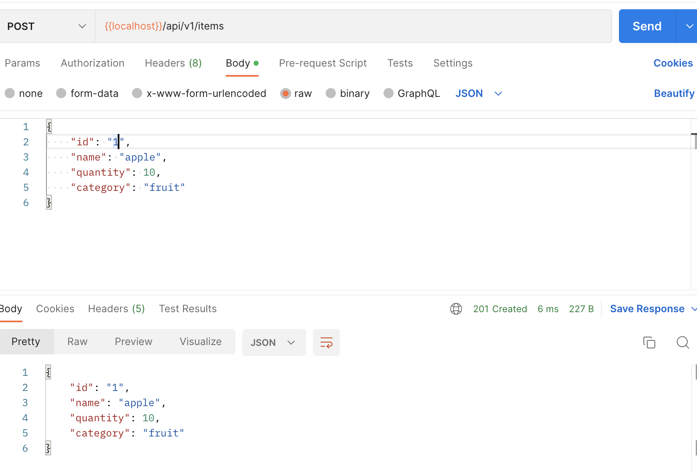
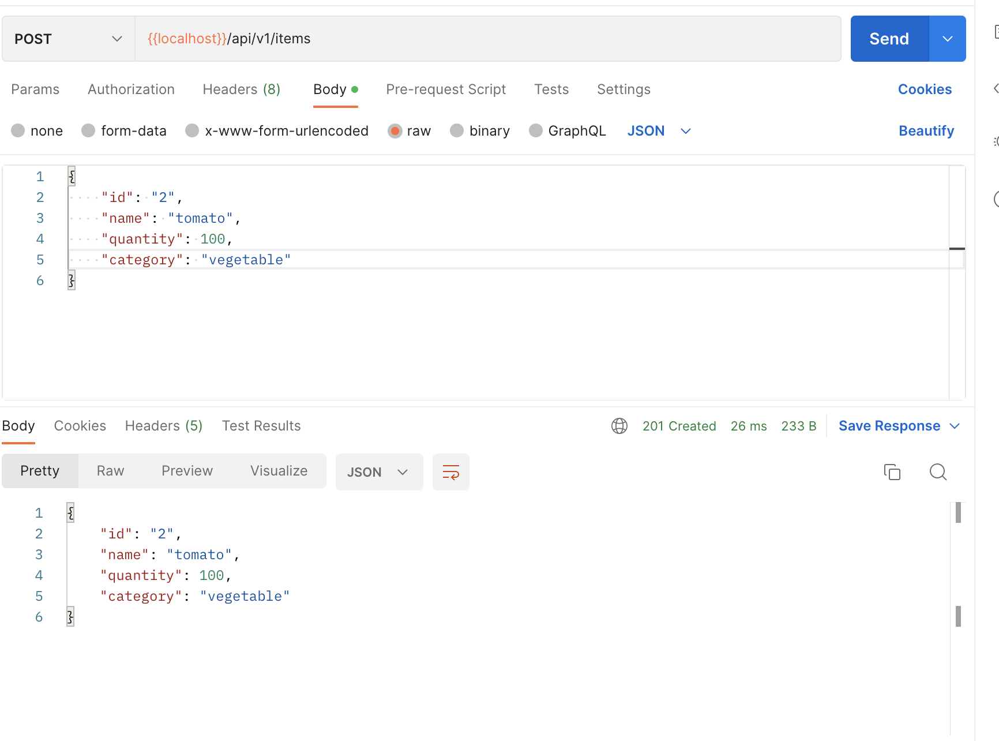
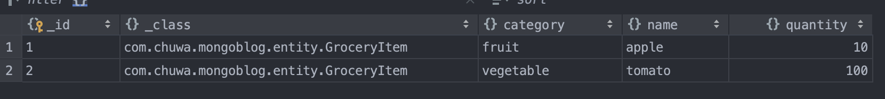

# HW7

## MySQL - Relational Database

### 1 Create `oms_company_address` table

```sql
CREATE TABLE oms_company_address
(
    id             bigint,
    address_name   varchar(200),
    send_status    int(1),
    receive_status int(1),
    name           varchar(64),
    phone          varchar(64),
    province       varchar(64),
    city           varchar(64),
    region         varchar(64),
    detail_address varchar(200),
    PRIMARY KEY (id)
);
```

### 2 Insert some random data to `oms_company_address` table

```sql
INSERT INTO
    oms_company_address
VALUES
    (1, 'address1', 0, 1, 'jd', '123456789', 'bj', 'bj', 'china', 'xxx-xxx-aaaa');
INSERT INTO
    oms_company_address
VALUES
    (2, 'address2', 0, 1, 'amazon', '213456332', 'seattle', 'wa', 'us', 'xxx-xxx-bbbb');
INSERT INTO
    oms_company_address
VALUES
    (3, 'address3', 1, 1, 'asd', '3423215', 'sadf', 'sd', 'afdsdas', 'xxx-xxx-cccc');
INSERT INTO
    oms_company_address
VALUES
    (4, 'address4', 0, 0, 'vfd', '123543', 'fds', 'df', 'adsffd', 'xxx-xxx-dddd');

```

### 3 Write a SQL query to fetch all data from `oms_company_address` table

```sql
SELECT *
FROM
    oms_company_address;
```

### 4 Write a SQL query to fetch top 3 records from `oms_company_address` table

```sql
SELECT *
FROM
    oms_company_address
LIMIT 3;
```

### 5 Update `oms_company_address` table to set all `phone` to 666-6666-8888

```sql
UPDATE oms_company_address
SET
    phone = '666-6666-8888';
```

### 6 Delete one entry from `oms_company_address` table

```sql
DELETE
FROM
    oms_company_address
WHERE
    id = 2;
```

## MongoDB - Non-SQL Database 

### 1 Create `test` DB

```sql
use test;
```

### 2 Create `oms_company_address` collection

```sql
db.createCollection("oms_company_address");
```

### 3 Insert few random entries to `oms_company_address` collection

```sql
db.oms_company_address.insertMany([{
    id: 1,
    address_name: 'aaaaa',
    send_status : 0,
    receive_status: 1,
    name: 'address1',
    phone: '123-321-3333',
    province: 'ny',
    city: 'nyc',
    region: 'us',
    detail_address: 'asdasfdfsf'
},
{
    id: 3,
    address_name: 'asdffsa',
    send_status : 1,
    receive_status: 1,
    name: 'address3',
    phone: '123-23-1231',
    province: 'nj',
    city: 'jc',
    region: 'us',
    detail_address: 'asdfssadf'
},
{
    id: 2,
    address_name: 'vvadas',
    send_status : 0,
    receive_status: 0,
    name: 'address2',
    phone: '123-321-32132',
    province: 'wa',
    city: 'sea',
    region: 'us',
    detail_address: 'agdsfads'
},
]);
```

### 4 Read one entry from `oms_company_address` collection

```sql
db.oms_company_address.find({'id': 2});
```

### 5 Read all entries from `oms_company_address` collection

```sql
db.oms_company_address.find();
```

### 6 Update one entry from `oms_company_address` collection

```sql
db.oms_company_address.updateOne({'id': 2}, {$set: {send_status: 1}});
```

### 7 Remove one entry from `oms_company_address `collection

``` sql
db.oms_company_address.deleteOne({'id': 2});
```

## API Design

### 1 Find 2 collection of APIs example. ie. Twitter, Paypal, Youtube etc.

+ Paypal(Some of Orders)

  ```java
  {{base_url}}/v2/checkout/orders // POST Create order
  {{base_url}}/v2/checkout/orders/:order_id // GET Show order details
  {{base_url}}/v2/checkout/orders/:order_id // PATCH Update order
  {{base_url}}/v2/checkout/orders/:order_id/capture // POST Capture payment for orders
  {{base_url}}/v2/checkout/orders/:order_id/authorize // POST Authorize payment for orders
  ```

+ Salesforce(Some of SMS)

  ```java
  https://{{et_subdomain}}.rest.marketingcloudapis.com/sms/v1/keyword // POST Create keyword
  https://{{et_subdomain}}.rest.marketingcloudapis.com/sms/v1/messageContact/{{et_smsmsg_id}}/history/{{et_sms_tokenId}}/mobileNumber/{{mobile_number}} // GET Message contact history
  https://{{et_subdomain}}.rest.marketingcloudapis.com/sms/v1/keyword/{{et_keyword_id}} // DELETE Delete keyword
  https://{{et_subdomain}}.rest.marketingcloudapis.com/sms/v1/contacts/subscriptions // GET Get subscription status
  https://{{et_subdomain}}.rest.marketingcloudapis.com/sms/v1/messageList/{{et_smsmsg_id}}/deliveries/{{et_smstoken_id}} // GET message list status
  ```

### 2 Design a collection of APIs for a Blog Website, please specify GET POST PUT DELETE

```java
api/v1/posts // GET Get all posts
api/v1/posts // POST Create a post
api/v1/posts/{postId} // PUT Updata a post
api/v1/posts/{postId} // DELETE Delete a post
```

### 3 Design APIs for the following features (思考：path variable 怎么用？有sub resources, 哪些地方该用复数)

+ find the customer's payments, like credit card 1, credit card 2, paypal, Apple Pay.

  ```
  api/v1/customer/{id}/payments
  ```

+ Find the customer's history orders from 10/10/2022 to 10/24/2022

  ```
  api/v1/customer/{id}/orders/history?from="10/10/2022"&to="10/24/2022"
  ```

+ find the customer's delievery  addresses

  ```
  api/v1/customer/{id}/address
  ```

+ If I also want to get customer's default payment and default delievery address, what kind of the API (URL) 
  should be?

  ```
  api/v1/customer/{id}/payment/default
  api/v1/customer/{id}/address/default
  ```

## Springboot

### 1 create a file to list all of the annotaitons you learned and known, and explain the usage and how do you understand it. you need to update it when you learn a new annotation. Please organize those annotations well, like annotations used by entity, annotations used by controller.

Shown in `annotations.md`

### 2 explain how the below annotaitons specify the table in database?

```java
@Column(columnDefinition = "varchar(255) default 'John Snow'")
```

The type of this column is `varchar(255)` and the default value is 'John Snow'.

```java
@Column(name="STUDENT_NAME", length=50, nullable=false, unique=false)
```

The name of this column is "STUDENT_NAME", the length of it is 50, values cannot be null and are not required to be unique.

### 3 What is the default column names of the table in database for `@Column`?

firstName and operatingSystem

### 4 What are the layers in springboot application? what is the role of each layer?

+ **Presentation Layer** – Authentication & Json Translation
+ **Business Layer** – Business Logic, Validation & Authorization
+ **Persistence Layer** – Storage Logic
+ **Database Layer** – Actual Database

### 5 Describe the flow in all of the layers if an API is called by Postman.

- The Client makes an **HTTP** request(GET, PUT, POST, etc.)
- The HTTP request is forwarded to the **Controller**. The controller maps the request. It processes the handles and calls the server logic.
- The business logic is performed in the **Service layer**. The spring boot performs all the logic over the data of the database which is mapped to the spring boot model class through Java Persistence Library(**JPA**).
- The JSP page is returned as Response from the controller.

### 6 What is the application.properties? do you know application.yml?

Application Properties support us to work in different environments.

Spring Boot supports YAML based properties configurations to run the application. Instead of application.properties, we can use application.yml file.

### 7 Create a Project, name it with mongo-blog, write a POST API for mongo-blog, change database to MongoDB;

Results are shown below. Code can be found in `Coding/mongo-blog`.







### 8 In your redbook application, write the code for RUD APIs.

Shown in `Coding/redbool`
