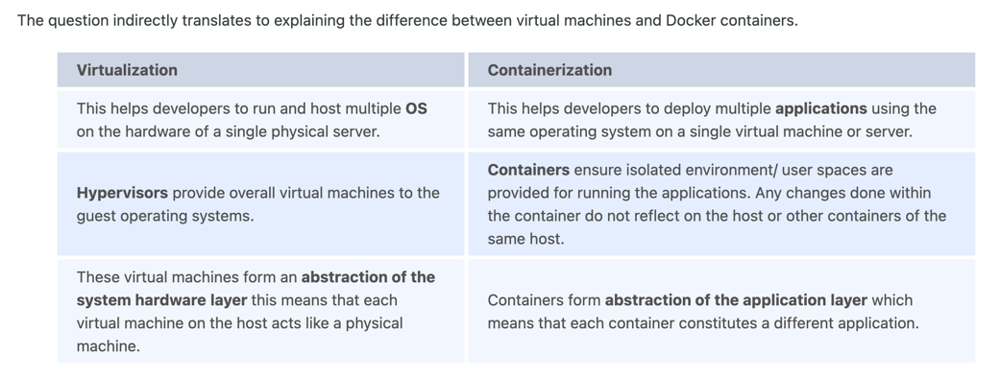

### 1. Can you tell something about docker container?

- They consist of applications and all their dependencies.
- They share kernel and system resources with other containers and run as isolated systems in the host operating systems.
- The main aim to of them is to get rid of the infrastructure dependency while building and running applications, which means that any containerized application can run on any platform and is not affected by the infrastructure used beneath.
- They are runtime instances of docker images.

### 2. What are docker images?

They are executable packages(bundled with application code & dependencies, software packages, etc.) used to create containers. Docker images can be deployed to any docker environment and the containers can be spun up there to run the application.

### 3. What is a DockerFile?

It is a text file that contains all the commands which are needed to build a given docker image.

### 4. Can you tell what is the functionality of a hypervisor?

It is a software that can make virtulization happen, so it is also reffered to as the Virtual Machine Monitor. It divides the resources of the host system and allocate them to each guest environment installed. It makes it possible to install multiple OS on a single host system.

There are two types:

1. **Native Hypervisor**: It is also called Bare-metal Hypervisor. It runs directly on the underlying host system which ensures the direct access to the host hardware. That is why it doesn't need base OS.
2. **Hosted Hypervisor**: This type makes use of the underlying host OS which has the exisiting OS installed.

### 5. What can you tell about Docker Compose?

It is a YAML file consists of all the details regrading various services, networks, and volumes that are needed for setting up the Docker-based application. So it is used to build mulitiple containers, host them and establish communication between them. In order to communicate amongst containers. ports are exposed by each and every container.

### 6. Can you tell something about docker namespace?

A namespace is basically a Linux feature that ensures OS resources partition in a mutually exclusive manner. This forms the core concept behind containerization as namespaces introduce a layer of isolation amongst the containers. In docker, the namespaces ensure that the containers are portable and they don't affect the underlying host. Examples for namespace types that are currently being supported by Docker – PID, Mount, User, Network, IPC.

### 7. What is the docker command that lists the status of all docker containers?

`docker ps -a`

### 8. On what circumstances will you lose data stored in a container?

When you remove the container.

### 9. What is docker image registry?

It is area where the docker images are stored. Instead of converting the applications to containers each and everytime, a developer can directly use the images stored in the registry. The image registry can either be public or private and Docker hub is the most popular and famous public registry available.

### 10. How many Docker components are there?

There are three docker components:

- **Docker Client**: It performs “build” and “run” operations for the purpose of opening communication with the docker host.
- **Docker Host**: It has the main docker daemon and hosts containers and their associated images. The daemon establishes a connection with the docker registry.
- **Docker Registry**: It stores the docker images. There can be a public registry or a private one. The most famous public registries are Docker Hub and Docker Cloud.

### 11. What is a Docker Hub?

It is a public cloud-based registry provided by Docker for storing public images of the containers along with the provision of finding and sharing them.

We can use the `docker push` command to push images to Docker Hub.

### 12. What command can you run to export a docker image as an archive?

`docker save -o <exported_name>.tar <container-name>`

### 13. What command can be run to import a pre-exported Docker image into another Docker host?

`docker load -i <export_image_name>.tar`

### 14. Can a paused container be removed from Docker?

No, you can only remove a container after stop it.

### 15. What command is used to check for the version of docker client and server?

+ `docker version` is used to get all version information of the client and server.

+ `docker version --format '{{.Server.Version}}'` is used to get only the server version details.

## Docker Intermediate Interview Questions

### 16. Differentiate between virtualization and containerization.

### 17. Differentiate between COPY and ADD commands that are used in a Dockerfile?

They have similar functionality but `COPY` is more perferred than `ADD` because it has higher transparency.

`COPY` can simplely copy local files into the container.

`ADD` have additional features such as remote URL and tar extraction support.

### 18. Can a container restart by itself?

Yes, it is possible if we use certain docker-defined policies while using the docker run command. Here are the policies:

- **Off**: The container will not be restarted if it fails or it is stopped.
- **On-failure**: The container will restart by itself only when it experiences failures not associated with users.
- **Unless-stopped**: It can restart only when the command is executed to stop it by the user.
- **Always:** The container will always get restarted in this type of policy irrespective of the failure or stopping.

The policy can be used like `docker run -dit — restart [restart-policy-value] [container_name]`

### 19. Can you tell the differences between a docker Image and Layer?

- **Image**: It is built up from several read-only layers of instructions. An image corresponds to the docker container and is used for speedy operation due to the caching mechanism of each step.
- **Layer**: Each layer corresponds to an instruction of the image’s Dockerfile. The layer is also an image but it is the image of the instructions run. The layer can be seen as intermidate images.

### 20. What is the purpose of the volume parameter in a docker run command?

- The syntax of `run` when using volume is `docker run -v host_path:docker_path <container_name>`.
- It is used for syncing a directory of a container(`docker_path`) with any of the host directories(`host_path`). We can sync the container with the data files from the host without having the need to restart it.
- It will alse ensure data security if the container is deleted. Even if the container is deleted, the data of the container exists in the volume mapped host location making it the easiest way to store the container data.

### 21. Where are docker volumes stored in docker?

Volumes are created and managed by Docker and cannot be accessed by non-docker entities. They are stored in Docker host filesystem at `/var/lib/docker/volumes/`

### 22. What does the docker info command do?

This command can get details of information about Docker installed on the host system. The information can be the number of containers or images and in what state they are running and hardware specifications like total memory allocated, speed of the processor, kernel version, etc.

### 23. Can you tell the what are the purposes of up, run, and start commands of docker compose?

- **Up**: Using up command for keeping a docker-compose up (ideally at all times), we can start or restart all the networks, services, and drivers associated with the app that are specified in the docker-compose.yml file. If the docker-compose are running up in the attached mode, we can get access to all the logs of the containers. If it is running in detached mode, then once the containers are started, it just exits and shows no logs.

- **Run**:Using the run command, the docker-compose can run one-off or ad-hoc tasks based on the business requirements. Here, the service name has to be provided and the docker starts only that specific service and also the other services to which the target service is dependent (if any).

  This command is helpful for testing the containers and also performing tasks such as adding or removing data to the container volumes etc.

- **Start**: Only containers which were created before and then stopped can be restarted. It cannot create new containers on its own.

### 24. What are the basic requirements for the docker to run on any system?

- For Windows, docker atleast needs Windows 10 64bit with 2GB RAM space. Docker can be installed by taking help of the toolbox for lower versions.
- For Linux, Docker can run on various Linux flavors such as Ubuntu >=12.04, Fedora >=19, RHEL >=6.5, CentOS >=6 etc.

### 25. Can you tell the approach to login to the docker registry?

Using `docker login` command credentials to log in to their own cloud repositories can be entered and accessed.

### 26. List the most commonly used instructions in Dockerfile?

- **FROM**: It is used to set the base image for the upcoming instructions. A Dockerfile is valid if it starts with the FROM instruction.
- **LABEL**: It is used for the image organization based on projects, modules, or licensing. It is also used for annotations. We can specify a key-value pair while defining a label which can be later accessed and handled programmatically.
- **RUN**: It is used to execute followed instructions on the top of the current image in a new later. With each RUN command execution, we add layers on top of the image and then use that in subsequent steps.
- **CMD**: It is used to provide default values of an executing container. If there are multiple CMD commands, only the last one will be considered.

### 27. Can you differentiate between Daemon Logging and Container Logging?

Docker has two levels of logging.

- **Daemon Logging**: There are four levels:
    + Debug: All the data which happened during the exectuion of the deamon process.
    + Info: All the information along with the error informationduring the exectuion of the deamon process.
    + Error: All the errors which occurred during the exectuion of the deamon process.
    + Fatal: Fatal errors which occurred  during the exectuion of the deamon process.
- **Container Logging**:
    + Container level logging can be done using the command: `sudo docker run –it <container_name> /bin/bash`
    + In order to check for the container level logs, we can run the command: `sudo docker logs <container_id>`

### 28. What is the way to establish communication between docker host and Linux host?

We can use networking by identifying the "ipconfig" on the docker host. This ensures that an ethernet adapter will be created as long as the docker is present in the host.

### 29. What is the best way of deleting a container?

First, stop the container `docker stop <container_id>`, then delete it `docker rm <container_id>`.

### 30. Can you tell the difference between CMD and ENTRYPOINT?

## Docker Advanced Interview Questions

### 31. Can we use JSON instead of YAML while developing docker-compose file in Docker?

Yes, use `docker-compose -f docker-compose.json up`

### 32. How many containers you can run in docker and what are the factors influencing this limit?

There are no clearly defined limit to the number of containers that can be run within docker.

The limitation depends on the hardware restrictions. The size of the app and the CPU resources available are 2 important factors influencing this limit.

### 33. Describe the lifecycle of Docker Container?

- **Created**: The container just created new but not start yet.
- **Running**: The container would be running with all its associated processes.
- **Paused**: A running container has been paused.
- **Stopped**: A running container has been stopped.
- **Deleted**: The container is in the dead state.

### 34. How to use docker for multiple application environments?

- Docker-compose can help. In the yaml file, we can define multiple services, networks, and containers along with the volume mapping in a clean manner, and then we can just call the command “docker-compose up”.
- When there are multiple environments involved - it can be either dev, staging, uat, or production servers, we would want to define the server-specific dependencies and processes for running the application. In this case, we can go ahead with creating environment-specific docker-compose files of the name “docker-compose.{environment}.yml” and then based on the environment, we can set up and run the application.

### 35. How will you ensure that a container 1 runs before container 2 while using docker compose?

Docker-compose does not wait for any container to be “ready” before going ahead with the next containers.

We can use `depends_on` in the file.

```yaml
version: "2.4"
services:
 backend:
   build: .
   depends_on:
     - db
 db:
   image: postgres
```

- `docker-compose up` will start and run the services in the dependency order specified.
- `docker-compose up SERVICE_NAME` by default includes the dependencies associated with the service.
- `docker-compose stop` also stops the services in the order of the dependency specified.