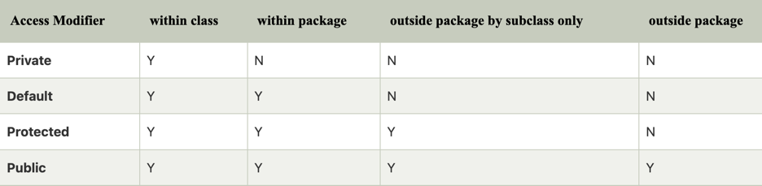
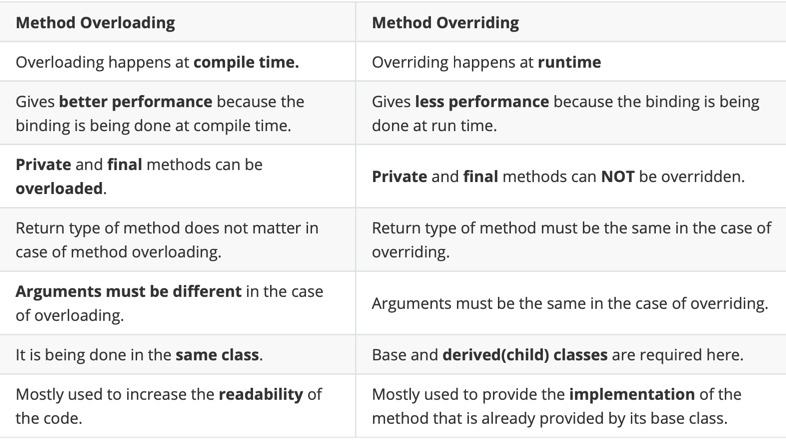

### 1.  Write up Example code to demonstrate the three foundmental concepts of OOP. (reference Code Demo repo as example)
1.  Encapsulation;
```
class Dog {
    private String name;

    public Dog(String name) {
        this.name = name;
    }

    public String getName() {
        return name;
    }

    public void setName(String name) {
        this.name = name;
    }
    
    public String nickName(){
        return  this.name + " is Dog";
    }
}
```
If we want to change the name  we can only do that by providing a setter method. The only way to get the dog  name information is through the getter method.
2.  Inheritance;
```
class Corgi extends Dog {
    private boolean isTrained;

    public Corgi(String name, boolean isTrained) {
        this.name = name;
        this.isTrained = isTrained;
    }

    public boolean isTrained() {
        return isTrained;
    }

    public void setTrained(boolean trained) {
        isTrained = trained;
    }
    
    @Override
    public String nickName(){
        return this.name + " is Corgi";
    }
}
```
3.  Polymorphism
```
 public static void main(String[] args) {
     Dog fido = new Dog("Fido");
     Corgi corgi = new Labrador("Buddy", true);
        
     System.out.println(fido.nickName()); // output :Fido is Dog
     System.out.println(corgi.nickName()); // output :Buddy is Corgi
    }
```

### 2.  What is wrapper class in Java and Why we need wrapper class?
A wrapper class is a class that wraps (or encases) a primitive data type in Java. For example, the wrapper class for the primitive int data type is Integer.
1. They convert primitive data types into objects. Objects are needed if we wish to modify the arguments passed into a method (because primitive types are passed by value).
2. The classes in java.util package handles only objects and hence wrapper classes help in this case also.
3. Data structures in the Collection framework, such as ArrayList and Vector, store only objects (reference types) and not primitive types.
4. An object is needed to support synchronization in multithreading.

### 3.  What is the difference between HashMap and HashTable?
>Hashmap is not thread-safe. &emsp;&emsp;&emsp;&emsp;&emsp;&emsp;&emsp;&emsp;&emsp;&emsp;&emsp;&emsp;&emsp;&emsp;&emsp;&emsp;&emsp;&emsp;  Hashtable is thread-safe.<br>
Null is allowed for both key and value. &emsp;&emsp;&emsp;Null is not allowed for both key and value.<br>
> Performance is high.&emsp;&emsp;&emsp;&emsp;&emsp;&emsp;&emsp;&emsp;&emsp;&emsp;&emsp;&emsp;&emsp;&emsp;&emsp;&emsp;&emsp;&emsp;&emsp;&emsp;&emsp;&emsp;&emsp;&emsp;&emsp;&emsp;&emsp;&emsp;&emsp;&emsp;&emsp;&emsp;performance is low. Because it is thread safe.


### 4.  What is String pool in Java and why we need String pool?
String Pool in Java is a special storage space in Java Heap memory where string literals are stored. It is also known by the names - String Constant Pool or String Intern Pool. Whenever a string literal is created, the JVM first checks the String Constant Pool before creating a new String object corresponding to it.

### 5.  What is Java garbage collection?
This is an inefficient usage of heap memory. In order to escalate the performance of our code and reduce memory usage, JVM optimizes the way in which strings are stored with the help of a string constant pool.
<p>When we create a string literal, the JVM first check that literal in the String pool. If the literal is already present in the pool, it returns a reference to the pooled instance. If the literal is not present in the pool, a new String object takes place in the String pool.

### 6.  What are access modifiers and their scopes in Java?
Private, Default, Public, Protected


### 7.  What is final key word? (Filed, Method, Class)
If a variable is declared as "final", its value cannot be changed after it is initialized.
```
final int a = 1;
int b = 1;
a = b; // error
```
<p>If a method is declared as "final," it cannot be overridden by a subclass. can't override.
<p>If a class is declared as "final," it cannot be subclassed.It cannot be extended.

### 8.  What is static keyword? (Filed, Method, Class). When do we usually use it?
Static Filed belong to a class, we can access them directly using the class name. We don't need any object instance.
<p> Static methods also belong to a class instead of an object. So, we can call them without creating the object of the class in which they reside.
<p> Static cannot normally be used to modify a class. It can only modify an inner class. This is called a static inner class. 
1. It is created independently of the creation of an outer class. 
2. It cannot use any non-static member variables and methods of the outer class.

### 9.  What is the differences between overriding and overloading?


### 10.  What is the differences between super and this?
Super in Java is used to refer to methods, static and instance variables, constructors of an immediate parent class.
<p>This in Java is used to refer to methods, static and instance variables, constructors of a current class.

### 11.  What is the Java load sequence?

The load sequence refers to the order in which the class loading mechanism loads classes and interfaces into the Java Virtual Machine (JVM).

1. Bootstrap class loader: This is the first class loader that is used by the JVM. It is responsible for loading the core Java classes and interfaces, such as java.lang.* and java.util.*, from the rt.jar file located in the JRE's lib directory.

2. Extension class loader: This class loader is responsible for loading classes and interfaces from the extension directory, usually located in the JRE's lib/ext directory.

3. System class loader: This is the class loader that is responsible for loading classes and interfaces from the classpath, which is specified by the user at runtime.

### 12.  What is Polymorphism ? And how Java implements it ?

Polymorphism in Java is the task that performs a single action in different ways.
<p>Compile Time Polymorphism，the call to the method is resolved at compile-time.Compile Time polymorphism is achieved through Method Overloading.

<p>Runtime polymorphism,the call to an overridden method is resolved dynamically at runtime rather than at compile-time.Compile Time polymorphism is achieved through Method Overriding.

### 13.  What is Encapsulation ? How Java implements it? And why we need encapsulation?

Encapsulation in Java is a mechanism of wrapping the data (variables) and code acting on the data (methods) together as a single unit. In encapsulation, the variables of a class will be hidden from other classes, and can be accessed only through the methods of their current class. Therefore, it is also known as data hiding.

To achieve encapsulation in Java −

1. Declare the variables of a class as private.
2. Provide public setter and getter methods to modify and view the variables values.
<p>Encapsulation allows the implementation of an object to change without affecting the code that uses it, providing more flexibility and maintainability to the code.   Encapsulation also helps to promote data security, by preventing unauthorized access to the internal data of an object.

### 14.  What is Interface and what is abstract class? What are the differences between them?

<p>Interface is a contract that defines a set of method signatures (i.e., the method name, return type, and parameter list) that a class must implement. Interfaces do not provide implementations for these methods, they simply define the methods that a class must have. A class can implement multiple interfaces, but it can only inherit from one superclass.

<p>An abstract class is a class that cannot be instantiated, but it can provide method implementations (i.e., concrete methods) and fields. An abstract class can also define abstract methods, which are methods without an implementation. Classes that inherit from an abstract class must provide implementations for the abstract methods defined by the abstract class.

<p>The main difference between an interface and an abstract class is that an interface can only define method signatures and cannot provide any implementation, while an abstract class can provide both method signatures and implementations. Additionally, a class can implement multiple interfaces, but it can only inherit from one abstract class.

### 15.  (OOD) Design a parking lot (put the code to codingQuestions/coding1 folder, )
1.  If you have no ability to design it, please find the solution in internet, then understand it, and re-type
    it.(Do NOT just copy and paste)

### 16.  What are Queue interface implementations and what are the differences and when to use what? 

The Queue interface in Java is a part of the Java Collection, and it represents a data structure that follows the First-In-First-Out (FIFO) order. Including:
<br>
* ArrayDeque: This is a resizable array-based implementation of the Deque interface, which extends the Queue interface. It is not thread-safe, but it is more efficient than using a LinkedList to implement a Queue.
* LinkedList: This is a doubly-linked list implementation of the List and Deque interfaces. It is not thread-safe, but it can be used to implement a Queue.
* PriorityQueue: This is a priority-based implementation of the Queue interface. It orders elements according to their natural order or according to a provided comparator.
<p> If your application requires a priority-based Queue, you should use a PriorityQueue. 
<p> If you need a queue that allows for constant time insertions and removals at both ends, you should use ArrayDeque. 
<p> LinkedList is a good option if you need a Queue and you also need to perform operations like adding or removing elements in the middle of the list.