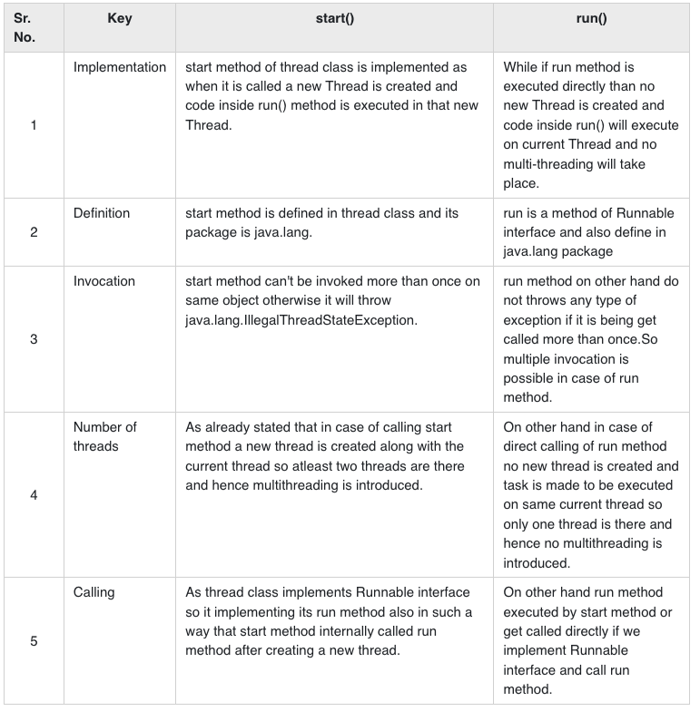

1. Explain volatile variables in java? (we also use it in Singleton)

   Volatile variables have the visibility features of synchronized but not the atomicity features. The values of the volatile variable will never be cached and all writes and reads will be done to and from the main memory.

2. how to create a new thread(Please also consider Thread Pool case)?

   You can create threads by implementing the runnable interface and overriding the run() method. Then, you can create a thread object and call the start() method. Thread Class: The Thread class provides constructors and methods for creating and operating on threads.

3. Difference between Runnable and Callable

   Callable interface and Runnable interface are used to encapsulate tasks supposed to be executed by another thread. However, Runnable instances can be run by Thread class as well as ExecutorService but Callable instances can only be executed via ExecutorService.

4. what is the diff between t.start() and t.run()?

5. Which way of creating threads is better: Thread class or Runnable interface?

   It is preferred to implement a Runnable interface instead of extending Thread class. As implementing Runnable makes your code loosely coupled as the code of thread is different from the class that assign job to the thread. It requires less memory and also allows a class to inherit any other class.

6. what is the thread status?

   New
   Runnable
   Blocked
   Waiting
   Timed Waiting
   Terminated

7. difference between wait() and sleep() method

   The major difference is that wait() releases the lock while sleep() doesn't release any lock while waiting. wait() is used for inter-thread communication while sleep() is used to introduce a pause on execution, generally.

8. What is deadlock?

   A deadlock is a situation in which two computer programs sharing the same resource are effectively preventing each other from accessing the resource, resulting in both programs ceasing to function.

9. how do threads communicate with each other?

   Inter-thread Communication
   All the threads in the same program share the same memory space. If an object is accessible to various threads then these threads share access to that object's data member and thus communicate each other. The second way for threads to communicate is by using thread control methods.

10. what is join() method?

    The join() method creates and returns a new string by concatenating all of the elements in an array (or an array-like object), separated by commas or a specified separator string. If the array has only one item, then that item will be returned without using the separator.

11. what is yield() method

    The yield() method is used in Java to hint the task scheduler to move the currently executing task to the Ready state and move another task or thread to the running state. The task scheduler is free to ignore the hint.

12. Explain thread pool

    In computer programming, a thread pool is a software design pattern for achieving concurrency of execution in a computer program. Often also called a replicated workers or worker-crew model, a thread pool maintains multiple threads waiting for tasks to be allocated for concurrent execution by the supervising program.

13. What is Executor Framework in Java, its different types and how to create these
    executors?

    The Executor Framework contains a bunch of components that are used to efficiently manage multiple threads. It was released with the JDK 5 which is used to run the Runnable objects without creating new threads every time and also mostly re-using the already created threads.
