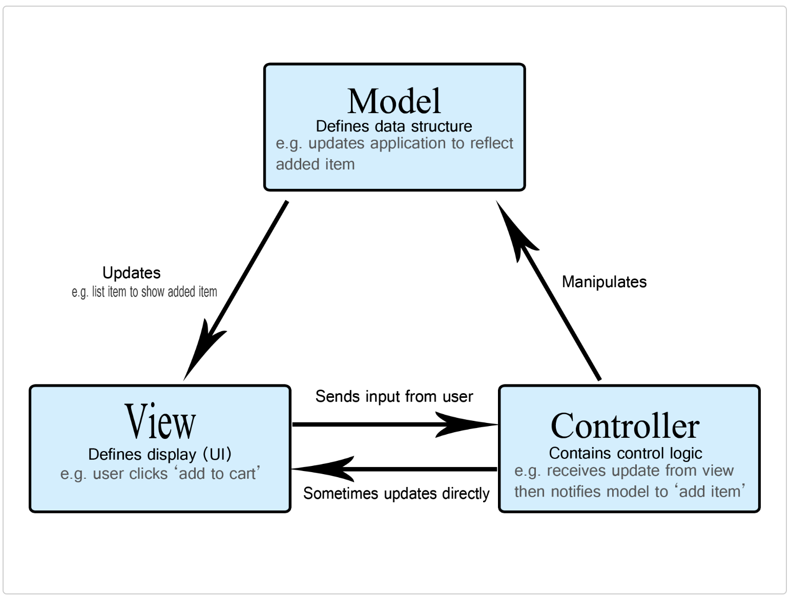

### Spring MVC

##### 1. List all of the annotations you learned from class and homework to `annotaitons.md`
The updates are now reflected in `annotations.md`.

##### 2. What is MVC pattern?

MVC (Model-View-Controller) is a pattern in software design commonly used to implement user interfaces, data, and controlling logic. It emphasizes a separation between the software's business logic and display. This "separation of concerns" provides for a better division of labor and improved maintenance. 

Model: Manage data and business logic
View: Handles layout and display
Controller: Routes commands to the model and view parts

##### 3. What is Front-Controller?
The front controller software design pattern is listed in several pattern catalogs and is related to the design of web applications. It is a controller that handles all requests for a website, which is a useful structure for web application developers to achieve flexibility and reuse without code redundancy.

##### 4. What is DispatcherServlet? please decribe how it works
The main function of DispatcherServlet is like a front controller for our SpringBoot applications. First, a request is sent from a client, then our application receives it, and DispatcherServlet would choose the suitable HandlerMapping from a list of handlerMappings. Then, it will invoke the suitable HandlerAdaptor to execute the logic to which the request is mapped to. And this would create our ModelAndView object, and the view could be then rendered in the client's browser.

##### 5. What is JSP and What is ModelAndView？(please google to have a basic knowlege)
JSP stands for Java Server Pages, and it's used to create dynamically changed web pages based on HTML, XML or other document types. 
ModelAndView is a holder for both Model and View in the web MVC framework. These two classes are distinct; ModelAndView merely holds both to make it possible for a controller to return both model and view in a single return value. The view is resolved by a ViewResolver object; the model is data stored in a Map.

##### 6. Could you please google any other servlets(理解多少是多少，不要花太多时间，知道servlet的名字就行。)
There are two main types of servlets:
Generic Servlets: Are protocol independent. They contain no inherent HTTP support or any other transport protocol.

HTTP servlets: Have built-in HTTP protocol support and are more useful in a Sun Java System Web Server environment.

All servlets must implement a service() method, which is responsible for handling servlet requests. For generic servlets, simply override the service method to provide routines for handling requests. HTTP servlets provide a service method that automatically routes the request to another method in the servlet based on which HTTP transfer method is used. So, for HTTP servlets, override doPost() to process POST requests, doGet() to process GET requests, and so on.

##### 7. How many web server do you know? (Tomcat, Jetty, Jboss)
Tomcat: Tomcat is a servlet and JSP container
- A Java (or Jakarta) servlet defines endpoints for HTTP requests and routes them to business logic code for handling.
- JSP, or Jakarta Server Pages, is a server-side view-rendering technology that allows defining HTML interfaces using data from inside the server and information from the request and response. We only write the servlet or JSP page, define rules for the requests and responses, then let Tomcat handle the routing.

Jetty: Jetty is an open source Java web server, as well as a servlet container, that provides an application with the features required to launch and run an application servlet or API.

Jboss: This web server is built based on the optimized Tomcat, and could provide users with much better performance.