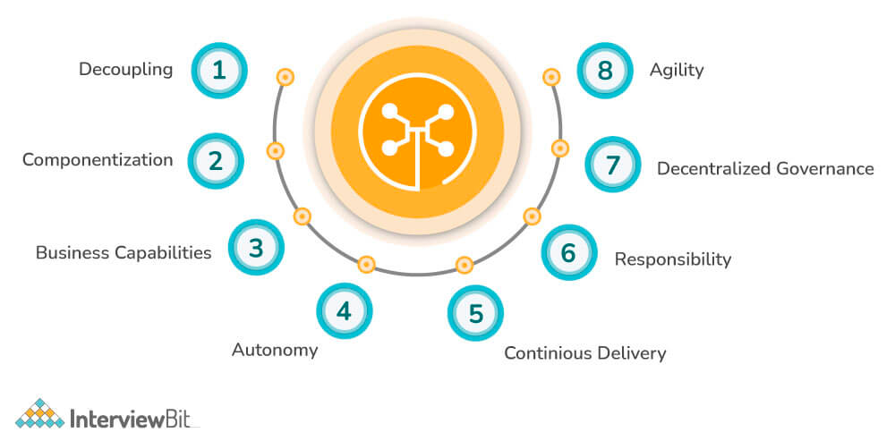

1. List all of the annotations you learned from class and homework to
    annotaitons.md
2. What is MVC pattern?  
Model-View-Controller  
   it is a software design pattern that separates an application into three interconnected components.
   Here's a brief overview of each of the components in the MVC pattern:
* Model: This component represents the data and business logic of the application. It typically includes classes that define the data structure, as well as methods for manipulating that data. 
* View: This component represents the user interface of the application. It typically includes classes that define the layout and appearance of the user interface, as well as any user interaction elements such as buttons, menus, or forms. 
* Controller: This component acts as the intermediary between the Model and the View. It receives input from the user, updates the Model accordingly, and then updates the View to reflect the changes in the Model. It typically includes classes that handle user input and communicate with the Model and View components.
4. What is Front-Controller?  
   The Front-Controller pattern is a software design pattern that provides a centralized entry point for handling requests in a web application. The main idea behind the pattern is to have a single component, called the Front Controller, responsible for receiving and handling all incoming requests.
   Here's how the Front-Controller pattern works:
* All incoming requests to the web application are directed to the Front Controller. 
* The Front Controller is responsible for routing the request to the appropriate controller or handler, based on the type of request and its parameters. 
* The appropriate controller or handler processes the request, typically by interacting with the Model component to retrieve or modify data, and then returns a response. 
* The Front Controller receives the response and sends it back to the client.

5. What is DispatcherServlet? please decribe how it works.
   The DispatcherServlet is a key component of the Spring MVC web framework. It acts as the Front Controller for Spring-based web applications, receiving incoming requests and dispatching them to the appropriate controllers or handlers for processing.
Here's how the DispatcherServlet works:
* When a client sends a request to a Spring-based web application, the request is intercepted by the Servlet Container (such as Tomcat or Jetty) and routed to the DispatcherServlet. 
* The DispatcherServlet consults the HandlerMapping component to determine the appropriate controller or handler for the incoming request. 
* Once the appropriate controller or handler has been identified, the DispatcherServlet passes the request along to it for processing. 
* The controller or handler processes the request, typically by interacting with the Model component to retrieve or modify data, and then returns a response. 
* The DispatcherServlet receives the response and consults the ViewResolver component to determine the appropriate view for rendering the response. 
* Once the view has been identified, the DispatcherServlet passes the response and any associated data to it for rendering. 
* The view generates the HTML, XML, or other output format for the response, which is then sent back to the client.
6. What is JSP and What is ModelAndView？(please google to have a basic
    knowlege)  
   JSP is a view technology used to generate dynamic web pages by embedding Java code directly into HTML pages. It allows developers to write Java code that is executed on the server-side and generates HTML pages dynamically based on data received from the Model component. JSP pages can be compiled into Java servlets at runtime, making them efficient and fast.   
ModelAndView is a class used in Spring MVC to combine both the Model and View components into a single object. It allows developers to pass data from the Model component to the View component for rendering. The Model component contains the application data, while the View component is responsible for rendering the data into an appropriate format (e.g. HTML). The ModelAndView object provides a simple and flexible way to pass data to the View component and specify which View should be used for rendering the response.
7. Could you please google any other servlets(理解多少是多少，不要花太多时间，
    知道servlet的名字就行。)  
* HttpServlet: A base class for servlets that handle HTTP requests and responses. It provides methods for handling various HTTP methods (GET, POST, etc.) and for sending HTTP responses. 
* Filter: A component that intercepts incoming requests and outgoing responses and performs some processing on them before they are handled by the servlet. Filters are often used for tasks such as authentication, logging, and request/response modification. 
* RequestDispatcher: A class that allows a servlet to forward a request to another resource (such as another servlet or a JSP page) for processing. This can be useful for organizing complex request handling logic across multiple servlets or for reusing common functionality. 
* HttpSession: A class that represents a user session in a web application. It allows data to be stored and retrieved across multiple requests from the same user, and is often used for storing user-specific information such as login credentials and shopping cart contents. 
* ServletContext: A class that represents the web application as a whole. It provides access to application-wide resources such as configuration parameters and shared data structures, and is often used for initializing the application and sharing resources across multiple servlets.
8. How many web server do you know? (Tomcat, Jetty, Jboss)
* Tomcat: An open-source web server and servlet container that is widely used for running Java web applications. It is known for its simplicity and ease of use.
* Jetty: An open-source web server and servlet container that is widely used for serving Java web applications. It is written in Java and can be run as a standalone server or embedded within other applications.
* Jboss: A popular open-source application server platform that is widely used for running Java-based enterprise applications. It was originally developed by JBoss Inc., which was later acquired by Red Hat in 2006.
* Apache HTTP Server: A free, open-source web server that is widely used on the internet. It supports a variety of operating systems and can be extended with modules to add functionality. 
* Nginx: A lightweight, high-performance web server that is often used as a reverse proxy or load balancer. It is known for its scalability and ability to handle high traffic volumes. 
* Microsoft IIS: A web server that is included with Windows operating systems. It is commonly used in enterprise environments and supports a range of Microsoft technologies such as ASP.NET. 
* Lighttpd: A lightweight, high-performance web server that is often used for serving static content or as a reverse proxy. It is known for its speed and low resource usage. 
* Caddy: A modern, easy-to-use web server that supports HTTPS by default and automatically generates SSL certificates. It is designed to be simple and secure.
9. clone this repo, and run it in you local.
    a. https://github.com/TAIsRich/springmvc5-demo
    b. Notice that you need to configure the Tomcat by yourself. tutorial in
    the slides.
    c.  find out the APIs in controlelr and call some APIs, In slides, I also list
    some API.
    d.  remeber to create a database for this project
    e.  all details in the slides.
 