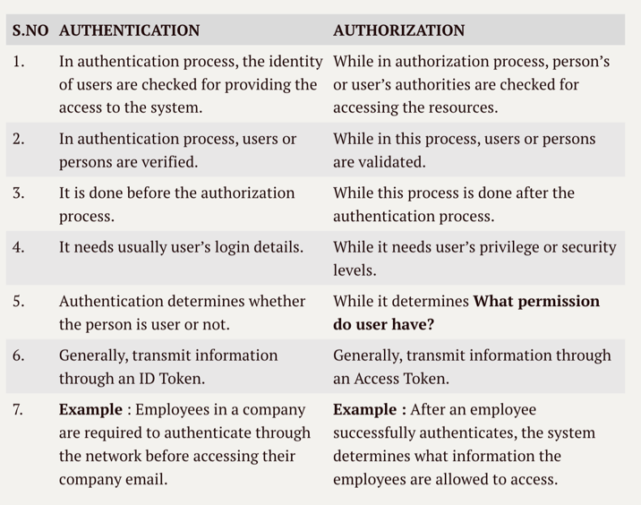
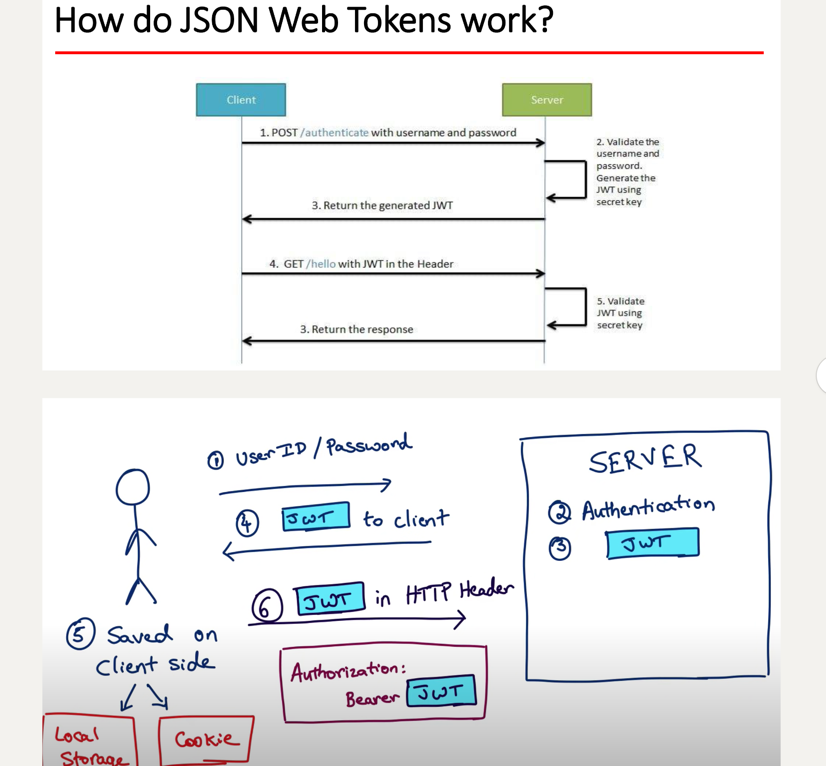

### 1.  List all the annotations you learned from class and homework to annotations.md
### 2.  What is the authentication?
Authentication is the process of verifying the identity of a person, system, or device. In the context of computer security, authentication is the mechanism that ensures that a user or a system is who or what it claims to be, before allowing access to resources or sensitive data.

### 3.  What is the authorization?
Authorization is the process of determining whether a user, system, or device has the necessary permissions or privileges to access a particular resource or perform a specific action. In other words, authorization is the mechanism that controls what a user or system can do once they have been authenticated.

### 4.  What is the difference between authentication and authorization?

### 5.  What is HTTP Session?
An HTTP session is a sequence of network requests and responses exchanged between a web client and a web server during a single browsing session. When a user interacts with a web application, the web server creates a unique session identifier, also known as a session ID, and sends it to the client in the form of a cookie or as part of the URL.

### 6.  What is Cookie?
A cookie is a small text file that a website sends to a user's web browser and that is stored on the user's computer or mobile device. Cookies are used to store information about the user's preferences, settings, and activities on the website, and to track the user's behavior across multiple sessions and pages.

There are two types of cookies: session cookies and persistent cookies. Session cookies are temporary cookies that are stored in the user's browser memory and are deleted when the user closes the browser. Persistent cookies are cookies that are stored on the user's computer or mobile device and remain there until they expire or are manually deleted by the user.

### 7. What is the difference between Session and Cookie?
- Implementation: Sessions are implemented on the server side, while cookies are implemented on the client side.
- Lifespan: Sessions typically last for the duration of a user's browsing session, which ends when the user closes the browser or logs out of the web application, while cookies can have a lifespan that ranges from a few minutes to several years.
- Storage location: Sessions are stored on the server, while cookies are stored on the client's computer or mobile device.
- Sessions can store an unlimited amount of data,while cookies can store only limited data(4kb).

### 8.  How do we use session and cookie to keep user information across the application?
We can use cookies to store user preferences or settings that should persist across multiple sessions or visits to your application, such as the user's language preference, theme preference, or font size preference.

To ensure the security and privacy of the user's information, you should follow best practices for secure session and cookie management, such as using HTTPS for all communication between the client and server, setting expiration dates for cookies, encrypting sensitive session or cookie data, and preventing common attacks, such as session hijacking, session fixation, or cookie theft.
### 9.  What is JWT?
JWT stands for JSON Web Token, which is an open standard for securely transmitting information between parties as a JSON object. A JWT consists of three parts separated by dots: a header, a payload, and a signature. The header and payload are base64-encoded JSON objects, while the signature is a hash of the header, payload, and a secret key using a cryptographic algorithm.

It can be used for an authentication system and can also be used for information exchange.

### 10. What is the spring security filter?
Spring Security Filter is a set of security filters provided by the Spring Security framework that are responsible for handling security-related tasks in a web application. These filters are configured to intercept incoming HTTP requests and perform various security checks and actions before passing the requests to the application's controller or endpoint.

### 11. describe how do JWT work(slides 里有图， 26页)

1. User logs in: When a user logs in to a web application or API, the server creates a JWT containing the user's identity and permissions, signs it with a secret key, and sends it to the client as a response.

2. JWT is stored: The client receives the JWT and stores it, typically in local storage or a cookie, and includes it in subsequent requests to the server as an authorization token.

3. JWT is sent to the server: When the client sends a request to the server, it includes the JWT as an authorization header or in the request payload.

4. JWT is validated: The server validates the JWT by verifying the signature using the same secret key that was used to sign the token. The server also checks the expiration time, issuer, and audience in the token's payload to ensure that it is still valid and issued by a trusted source.

5. Access is granted or denied: If the JWT is valid and authorized, the server grants access to the requested resource or operation. If the JWT is invalid or unauthorized, the server denies access and returns an error response.

6. User logs out or token expires: When the user logs out or the JWT expires, the client removes the JWT from storage or invalidates it on the server-side.

### 12. Do you use any Encoder to encode Password?
In Java, the Spring Security framework provides several built-in password encoding algorithms, such as BCrypt, SCrypt, and PBKDF2, which are considered secure and recommended for production use. These algorithms use a combination of salt, hashing, and iteration to produce a strong and unique hash value for each password, which makes it difficult for attackers to crack passwords through brute-force or dictionary attacks.

### 13. What is UserDetailService? AuthenticationProvider?AuthenticationManager? AuthenticationFilter?(把这几个名字看熟悉也行)

### 14. What is the disadvantage of Session? how to overcome the disadvantage?
disadvantage:
1. Server Memory Usage: Storing user session data on the server-side requires memory resources, which can become a scalability and performance issue if the application has a large number of users or heavy session data.

2. Session Invalidation: Sessions can become invalid if the server restarts, the application is redeployed, or the user's session times out, which can result in loss of session data and a negative user experience.

overcome:
1. Session Persistence: Rather than storing session data in memory, developers can use persistent storage solutions such as databases, cache servers, or file systems to store session data, which can improve scalability and reliability.

2. Session Replication: Developers can implement session replication strategies, such as clustering or data replication, to ensure that session data is replicated across multiple servers, which can improve availability and failover.

3. Session Timeouts: Developers can set reasonable session timeouts to prevent sessions from becoming invalid and to free up server resources, which can improve performance and scalability.

### 15. how to get value from application.properties?
use `@Value` annotation

### 16. What is the role of configure(HttpSecurity http) and configure(AuthenticationManagerBuilder auth)?
Configure(HttpSecurity http) method is responsible for configuring the security filters and rules that are applied to incoming HTTP requests. This method is used to set up the authentication and authorization rules for the application, such as specifying which endpoints are protected, which users or roles can access specific resources, and which authentication and authorization mechanisms are used.

Configure(AuthenticationManagerBuilder auth) method, on the other hand, is used to configure the authentication mechanism used by the application. This method is responsible for setting up the user authentication and credential management, such as defining the user authentication providers, setting up custom authentication logic, and configuring password encoding algorithms.

### 17.  What is Spring security authentication and authorization?
Authentication is the process of verifying the identity of a user, which involves validating the user's credentials such as username and password, and ensuring that the user is who they claim to be.

Authorization is the process of granting or denying access to resources based on the user's role or permissions. Spring Security provides a powerful and flexible authorization framework that allows developers to define access rules based on various criteria such as user roles, permissions, request methods, request parameters, and more.

### 18. Reading, 泛读一下即可，自己觉得是重点的，可以多看两眼。https://www.interviewbit.com/spring-security-interview-questions/#is-security-a-cross-cutting-concern
    a. 1-12
    b. 17 - 30
 