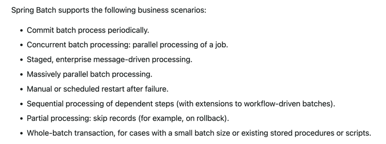

### 1.  List all the annotations you learned from class and homework to annotations.md
### 2.  Briefly reading: https://www.techgeeknext.com/spring-boot/spring-aop-interview-questions
### 3.  What is the Aspect Oriented Programming?
Aspect-oriented programming is a programming paradigm that tries to solve problems with cross-cutting concerns.  Aspect-oriented programming (AOP) complements object-oriented programming (OOP) by providing a different way to think about program structure.

For example : it helps us to refactor the different necessary repeating codes into different modules.  This gives us the benefit that we can maintain these functionalities in one single place, instead of it writing down every time.

### 4.  What are the advantages and disadvantages of Spring AOP?
Advantages:

- Modularity: Spring AOP allows developers to separate cross-cutting concerns from the main codebase, making it easier to manage and maintain the application.

- Reusability: Aspects can be reused across different parts of the application, reducing code duplication and increasing code reusability.

- Reduced complexity: By separating cross-cutting concerns from the main codebase, Spring AOP can help reduce the complexity of the code, making it easier to understand and maintain.

- Performance: Spring AOP is lightweight and efficient, resulting in minimal overhead and optimal application performance.

Disadvantages:

- Limited functionality: Spring AOP only supports method-level interception, which may not be sufficient for complex cross-cutting concerns.

- Complexity: Spring AOP can add complexity to the application, especially when dealing with complex pointcuts and aspects.

- Debugging: Debugging Spring AOP can be challenging, especially when dealing with complex pointcuts and aspects.
### 5.  What is Aspect in Spring AOP?
Aspect: An aspect is a modularization of a concern that cuts across multiple classes. Examples of aspects are logging, security, and transaction management.

### 6.  What is Pointcut in Spring AOP?
Pointcut: A pointcut is a predicate that matches one or more joinpoints. It determines which methods will be intercepted by an aspect.

### 7. What is the Join point in Spring AOP?
Joinpoint: A joinpoint is a point in the execution of a program, such as a method call or an exception being thrown.
A JointPoint represents a point in the execution of a program where an Aspect can be applied.  It could be a method call, an exception being thrown, or even the execution of a constructor.

### 8.  What does it mean by Advice and its types in Spring AOP?
Advice: Advice is the code that gets executed at a joinpoint. It is associated with a pointcut and is executed when the joinpoint identified by the pointcut is reached.
Before advice,After advice,Around advice,After returning advice,After throwing advice

### 9.  Reading: https://www.javainuse.com/spring/sprbatch_interview
### 10. When to use Spring Batch?

### 11. How Spring Batch works?
- Job: A job is the top-level container for a batch processing task. It consists of one or more steps, which are executed in sequence. Jobs can be scheduled or triggered manually.

- Step: A step represents a single unit of work in a batch processing task. Each step consists of a reader, a processor, and a writer. The reader reads data from a source, the processor transforms the data, and the writer writes the data to a destination.

- ItemReader: An ItemReader is responsible for reading data from a source, such as a file or a database. It reads data in chunks, which are processed by the processor.

- ItemProcessor: An ItemProcessor is responsible for transforming the data read by the reader. It can perform any kind of data manipulation, such as filtering, sorting, or aggregation.

- ItemWriter: An ItemWriter is responsible for writing the processed data to a destination, such as a file or a database. It writes data in chunks, which are read by the reader.

- JobRepository: The JobRepository is responsible for managing the state of the job and its steps. It stores job and step execution information, such as start time, end time, status, and parameters.

- JobLauncher: The JobLauncher is responsible for starting the execution of a job. It receives a job instance and its parameters from the client and delegates the execution to the JobRepository.

- JobExecution: The JobExecution represents the execution of a job. It contains information about the job parameters, start time, end time, status, and any exceptions that occurred during execution.
### 12. How can we schedule a Spring Batch Job?
- Using Spring's TaskScheduler: Spring provides a TaskScheduler interface that can be used to schedule tasks, including batch jobs. The TaskScheduler can be configured with a cron expression or a fixed delay to execute the job at a specific time or interval.

- Using Spring's Scheduling Annotations: Spring provides a set of annotations for scheduling tasks, including batch jobs. The @Scheduled annotation can be used to specify a fixed delay or a cron expression for executing the job.

- Using Java Timer: Java provides a Timer class that can be used to schedule tasks at a specific time or interval. The Timer can be configured with a TimerTask that executes the batch job.

- Using External Scheduling Tools: External scheduling tools, such as cron, can be used to schedule batch jobs. The job can be configured with a command-line interface or a REST API that triggers the job execution.

- Using Spring Cloud Data Flow: Spring Cloud Data Flow provides a graphical user interface for scheduling batch jobs. The jobs can be deployed and scheduled using the Spring Cloud Data Flow server.
### 13. What is the cron expression?
A cron expression is a string that specifies a schedule for a recurring job or task.   The fields are separated by spaces or tabs, and each field represents a different aspect of the schedule, such as minute, hour, day of the month, month, day of the week, and year

### 14. What is the spring task?
Spring task scheduling for a task/job is a time based scheduled process which runs automatically as per the configuration supplied. Once scheduling is enabled in application, a scheduled task can execute automatically in Spring application.

### 15. When to use Spring task?
- Long-Running Tasks: When a task takes a long time to complete and you don't want to block the main application thread, you can use Spring Tasks to execute the task asynchronously in a separate thread or thread pool.

- Background Processing: When you have background processing that needs to be executed independently of the main application flow, you can use Spring Tasks to execute the processing asynchronously.

- Scheduled Tasks: When you have tasks that need to be executed at a specific time or interval, you can use Spring Tasks to schedule the tasks using the TaskScheduler interface.

- Parallel Processing: When you have processing that can be executed in parallel, you can use Spring Tasks to execute the processing concurrently using a thread pool.
### 16. What is Filter and any filter example?
In Spring Framework, a filter is an object that performs some processing on a web request and/or response before it reaches the servlet or after it has been processed by the servlet. Filters are used to intercept and modify the incoming request or outgoing response.

Filters are implemented as classes that implement the javax.servlet.Filter interface. They can be configured in the web.xml file or using annotations in Spring MVC.
### 17.  What is the Interceptor? What we can do with interceptor?
In Spring Framework, an interceptor is an object that intercepts HTTP requests and responses before they reach the controller or after they have been processed by the controller. Interceptors are similar to filters, but they operate at a higher level of abstraction and provide more fine-grained control over the processing of requests and responses.

Interceptors are implemented as classes that implement the HandlerInterceptor interface. They can be configured in Spring MVC using XML or Java-based configuration.

Here are some of the things you can do with interceptors:

- Pre-Process Request: You can use an interceptor to preprocess an HTTP request before it reaches the controller. For example, you can perform authentication or authorization checks, modify request parameters or headers, or log the request.

- Post-Process Response: You can use an interceptor to post-process an HTTP response after it has been processed by the controller. For example, you can modify response parameters or headers, add custom error messages or status codes, or log the response.

- Modify Model Data: You can use an interceptor to modify model data that is passed from the controller to the view. For example, you can add or remove attributes from the model, or perform custom data transformation.

- Modify View: You can use an interceptor to modify the view that is used to render the response. For example, you can change the view name, modify view parameters or headers, or add custom error messages or status codes.

- Handle Exceptions: You can use an interceptor to handle exceptions that are thrown during the processing of an HTTP request. For example, you can catch exceptions and return custom error messages or status codes, or perform custom error handling.
### 18. In Interceptor, What is preHandle? What is postHandle?
The preHandle() method is called before the controller is executed, and it allows you to perform some processing before the controller is invoked. This method returns a boolean value indicating whether the request should continue to be processed or not. If this method returns true, then the processing continues, otherwise, the processing is stopped and the response is sent back to the client.

The postHandle() method is called after the controller is executed, but before the view is rendered. This method allows you to modify the model data that will be passed to the view, or to perform some other processing after the controller has finished its work. This method does not affect the processing of the response.
### 19. What is Swagger?
Swagger is an open-source tool that helps developers design, document, and consume RESTful web services. It provides a framework for describing the structure of RESTful web services using a JSON or YAML format, which can be used by developers to generate documentation and code samples automatically.

With Swagger, developers can create a machine-readable description of their APIs, including details such as endpoints, parameters, responses, and data models. 