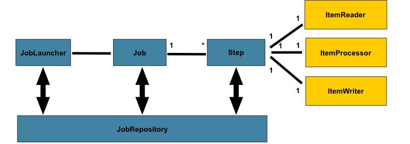

# hw46-AOP&Cron&Batch&Filter&Interceptor-0303


### 1 List all of the annotations you learned from class and homework to annotaitons.md

### 2 Briefly reading: https://www.techgeeknext.com/spring-boot/spring-aop-interview-questions

### 3 What is the Aspect Oriented Programming?

> Aspect-oriented programming (AOP) is a programming technique that supports the separation of **cross-cutting concerns** in order to increase modularity.

AOP is typically used to implement **cross-cutting concerns**, which implies that it defines functionality that is required in multiple places across an application in one place. You can add new functionality before or after a method is executed like transaction management, logging or security which cut across multiple types and objects (often termed crosscutting concerns).

### 4 What are the advantages and disadvantages of Spring AOP?

##### Advantages of Spring AOP

1. It is easy to configure.
2. Spring AOP is implemented in pure Java, so separate compilation unit or separate class loader are not required.
3. It utilizes Spring's IOC container for dependency injection.
4. Can create aspects using `@AspectJ` annotation based or using XML based.
5. It integrates cross-cutting concerns into the classes,.

##### Disadvantages of Spring AOP

1. Debugging the AOP framework-based application code is a little challenge.
2. Only methods with a public visibility will be recommended, not those with a private, protected, or default visibility.
3. Aspects cannot be advised by other aspects. This is because once a class is marked as an aspect (using XML or annotation), Spring prevents it from being auto-proxied.

### 5 What is Aspect in Spring AOP?

> An aspect is a **cross-cutting module that combines advice and pointcuts**. A standard class tagged with the `@Aspect` annotation can be used to implement an aspect.

Aspects are mostly used to enable cross-cutting concerns like logging, profiling, caching, and transaction management.

### 6 What is Pointcut in Spring AOP?

A pointcut is an **expression** that chooses one or more join points at which advice is given. Pointcuts can be defined using **expressions or patterns**. It supports a number of expressions that correspond to the join points.

### 7 What is the Join point in Spring AOP?

A join point is a place in the application where an **AOP aspect** is applied. It could also be a specific advice execution instance. A join point in AOP can be a method execution, exception handling, changing the value of an object variable, and so on.

### 8 What does it mean by Advice and its types in Spring AOP?

The advice is an **action which we take before or after the method execution**. In the Spring AOP framework, there are five types of advice: **before**, **after**, **after-returning**, **after-throwing**, and **around advice**. Advice is taken at a specific join point.

### 9 Reading: https://www.javainuse.com/spring/sprbatch_interview

### 10 When to use Spring Batch?

Consider an environment where users have to do a lot of batch processing. This will be quite different from a typical web application which has to work 24/7. But in classic environments it's not unusual to do the heavy lifting for example during the night when there are no regular users using your system. Batch processing includes typical tasks like reading and writing to files, transforming data, reading from or writing to databases, create reports, import and export data and things like that. Often these steps have to be chained together or you have to create more complex workflows where you have to define which job steps can be run in parallel or have to be run sequentially etc. That's where a framework like Spring Batch can be very handy. Spring Boot Batch provides reusable functions that are essential in processing large volumes of records, including logging/tracing, transaction management, job processing statistics, job restart, skip, and resource management. It also provides more advanced technical services and features that will enable extremely high-volume and high performance batch jobs though optimization and partitioning techniques.Simple as well as complex, high-volume batch jobs can leverage the framework in a highly scalable manner to process significant volumes of information.

### 11 How Spring Batch works?



- **step -** A Step that delegates to a Job to do its work. This is a great tool for managing dependencies between jobs, and also to modularise complex step logic into something that is testable in isolation. The job is executed with parameters that can be extracted from the step execution, hence this step can also be usefully used as the worker in a parallel or partitioned execution.
- **ItemReader -** Strategy interface for providing the data. Implementations are expected to be stateful and will be called multiple times for each batch, with each call to read() returning a different value and finally returning null when all input data is exhausted. Implementations need not be thread-safe and clients of a ItemReader need to be aware that this is the case. A richer interface (e.g. with a look ahead or peek) is not feasible because we need to support transactions in an asynchronous batch.
- **ItemProcessor -** Interface for item transformation. Given an item as input, this interface provides an extension point which allows for the application of business logic in an item oriented processing scenario. It should be noted that while it's possible to return a different type than the one provided, it's not strictly necessary. Furthermore, returning null indicates that the item should not be continued to be processed.
- **ItemStreamWriter -** Basic interface for generic output operations. Class implementing this interface will be responsible for serializing objects as necessary. Generally, it is responsibility of implementing class to decide which technology to use for mapping and how it should be configured. The write method is responsible for making sure that any internal buffers are flushed. If a transaction is active it will also usually be necessary to discard the output on a subsequent rollback. The resource to which the writer is sending data should normally be able to handle this itself.

### 12 How can we schedule a Spring Batch Job?

To schedule a Spring Batch job, you can use the built-in scheduling capabilities provided by Spring Framework. Here are the steps you can follow:

1. Add the Spring Batch and Spring Scheduler dependencies to your project.
2. Create a Spring Batch job by defining a Job instance, which includes a set of Step instances that define the work to be done.
3. Configure the job to run at a specific time or at regular intervals using the Spring Scheduler.
4. Create a SchedulerFactoryBean bean in your Spring configuration file and set its properties to define the scheduling details, such as the start time, end time, and frequency of the job.
5. Define a JobLauncher bean that will be used to launch the job when the scheduled time arrives.
6. Use the @Scheduled annotation to specify the schedule for your job. You can set the cron expression or use other schedule-related attributes provided by Spring Scheduler.

### 13 What is the cron expression?

A cron expression is a string consisting of six or seven fields, separated by spaces or tabs, that represent individual values for the second, minute, hour, day of the month, month, day of the week, and (optionally) year. It is used to define the schedule of a recurring job in the Spring Scheduler, and it allows you to specify the exact times at which the job should run.

The format of a cron expression is as follows:

```<second> <minute> <hour> <day-of-month> <month> <day-of-week> <year (optional)>```

Each field can contain a value or a wildcard character, which represents all possible values. For example, "*" in the minute field means "every minute".

You can also use special characters to define specific ranges of values, such as "-" to indicate a range of values, "," to specify multiple values, and "/" to specify increments. For example, "0 0 12-18 ? * MON-FRI" means "every weekday between 12:00 PM and 6:00 PM".

Here is an overview of the cron expression fields:

- Second: 0-59
- Minute: 0-59
- Hour: 0-23
- Day of month: 1-31
- Month: 1-12 or JAN-DEC
- Day of week: 0-6 or SUN-SAT
- Year: empty, or 4-digit year (e.g. 2023)

### 14 What is the spring task?

Spring Task is a feature of the Spring Framework that allows you to schedule tasks or jobs to run at a specific time or at regular intervals. It provides a simple and easy-to-use API for scheduling tasks within a Spring application context.

Spring Task is built on top of the Java Executor framework and provides a way to execute tasks in a separate thread pool. This ensures that the main thread of the application is not blocked while the task is being executed. The task can be a simple method call or a complex job that requires more processing.

To use Spring Task, you need to add the Spring Task dependency to your project and configure a TaskScheduler bean in your Spring configuration file. You can then annotate your task method with the @Scheduled annotation and specify the schedule for your task using a cron expression or other scheduling attributes provided by Spring Task.

### 15 When to use Spring task? 

You can use Spring Task when you need to schedule tasks or jobs to run at a specific time or at regular intervals within a Spring application context. Here are some examples of when you might want to use Spring Task:

1. Running batch jobs: Spring Task is ideal for running batch jobs that need to be executed at a specific time or at regular intervals, such as generating reports or processing data.
2. Sending emails: If your application needs to send out emails at specific times or intervals, Spring Task can be used to schedule the sending of these emails.
3. Performing database maintenance tasks: If your application needs to perform database maintenance tasks, such as backing up or optimizing the database, Spring Task can be used to schedule these tasks to run at specific times or intervals.
4. Running background tasks: If your application needs to perform background tasks, such as cleaning up temporary files or running data validations, Spring Task can be used to schedule these tasks to run at specific times or intervals.
5. Performing system health checks: Spring Task can be used to schedule system health checks that monitor the application and alert you if any issues arise.

Overall, Spring Task is a lightweight and easy-to-use scheduling solution that is useful for a wide range of applications. It provides a simple and consistent API for scheduling tasks within a Spring application context, and it allows you to execute tasks in a separate thread pool to avoid blocking the main thread of the application.

### 16 What is Filter and any filter example?

In web development, a filter is a component that intercepts and processes HTTP requests and responses in a web application. Filters are used to perform tasks such as authentication, logging, and data compression, and they can be applied to any servlet or JSP in a web application.

Filters are implemented as Java classes that implement the javax.servlet.Filter interface, and they can be configured in the web.xml deployment descriptor file of a web application.

Here are some commonly used filters in web development:

1. Authentication filters: These filters are used to authenticate users based on their credentials, such as username and password.
2. Authorization filters: These filters are used to restrict access to certain resources or actions based on the user's role or permissions.
3. Logging filters: These filters are used to log incoming HTTP requests and outgoing responses, including headers and parameters.
4. Compression filters: These filters are used to compress data before sending it over the network to improve performance and reduce bandwidth usage.
5. Caching filters: These filters are used to cache frequently accessed resources or data to improve performance and reduce server load.
6. Character encoding filters: These filters are used to set the character encoding of incoming requests and outgoing responses to ensure consistent handling of text data.
7. Cross-site scripting (XSS) filters: These filters are used to prevent cross-site scripting attacks by sanitizing or escaping user input.
8. Cross-origin resource sharing (CORS) filters: These filters are used to control access to resources across different domains or origins.

### 17 What is the Interceptor? What we can do with interceptor?

In web development, an interceptor is a component that intercepts and processes HTTP requests and responses in a web application. Interceptors are similar to filters, but they are more specialized and typically used for handling specific types of requests or actions.

Interceptors are implemented as Java classes that implement the org.springframework.web.servlet.HandlerInterceptor interface, and they can be configured in the Spring MVC framework to intercept requests and responses.

Here are some things you can do with interceptors:

1. Authentication and authorization: You can use interceptors to authenticate and authorize users based on their credentials and roles.
2. Logging and auditing: You can use interceptors to log incoming requests and outgoing responses, including headers and parameters, and to audit user actions within the application.
3. Error handling: You can use interceptors to handle exceptions and errors that occur during request processing and to return appropriate error responses to clients.
4. Caching and performance optimization: You can use interceptors to cache frequently accessed data and resources, to optimize response times and reduce server load.
5. Request preprocessing and postprocessing: You can use interceptors to preprocess and postprocess requests and responses, such as by adding or removing headers, transforming data, or performing validations.

Overall, interceptors are a powerful tool for intercepting and processing HTTP requests and responses in a Spring MVC web application. They allow you to perform a wide range of tasks, from authentication and logging to error handling and performance optimization.

### 18 In Interceptor, What is preHandle? What is postHandle?

In Spring MVC's HandlerInterceptor interface, there are three methods that allow you to intercept and process HTTP requests and responses at different stages of the request processing pipeline: preHandle(), postHandle(), and afterCompletion().

The preHandle() method is called before the actual handler method is invoked, and it allows you to perform actions before the request is processed by the controller method. The method signature looks like this:

```java
boolean preHandle(HttpServletRequest request, HttpServletResponse response, Object handler) throws Exception;
```

Here, the method parameters are:

- `request`: The incoming HTTP request object.
- `response`: The outgoing HTTP response object.
- `handler`: The handler object that will be used to process the request.

The preHandle() method returns a boolean value indicating whether the request should be processed further by the controller method or not. If the method returns `true`, the request will be processed by the controller method. If the method returns `false`, the request will be stopped and no further processing will occur.

The postHandle() method is called after the handler method is invoked, but before the view is rendered. It allows you to perform actions after the controller method has completed processing the request, but before the response is sent to the client. The method signature looks like this:

```java
void postHandle(HttpServletRequest request, HttpServletResponse response, Object handler, ModelAndView modelAndView) throws Exception;
```

Here, the method parameters are:

- `request`: The incoming HTTP request object.
- `response`: The outgoing HTTP response object.
- `handler`: The handler object that was used to process the request.
- `modelAndView`: The ModelAndView object that was returned by the controller method, containing the view name and model data.

The postHandle() method allows you to modify the ModelAndView object or the HTTP response before the view is rendered. For example, you can add attributes to the model, modify the view name, or set headers on the HTTP response.

Overall, the preHandle() and postHandle() methods provide a powerful mechanism for intercepting and processing HTTP requests and responses in a Spring MVC web application. They allow you to perform a wide range of tasks, from authentication and logging to error handling and performance optimization.

### 19 What is Swagger?

Swagger is an open-source software framework for designing, building, and documenting RESTful APIs. It provides a set of tools for developers to create APIs in a standardized way, using a common language and structure.

With Swagger, developers can define APIs using a simple and intuitive YAML or JSON format, which can be easily read and understood by both humans and machines. The Swagger tools then use this definition to generate documentation, client libraries, and server stubs, which can significantly reduce development time and improve API quality.

Swagger also provides a user-friendly interface, known as Swagger UI, which allows developers to explore and test APIs directly from their web browsers. This interface displays the API documentation in a clear and organized way, making it easy for developers to understand the API's capabilities and parameters.

In addition to documentation and code generation, Swagger also provides other features, such as API versioning, security, and testing. Overall, Swagger is a powerful tool for building and documenting high-quality RESTful APIs, and it has become widely adopted in the industry.