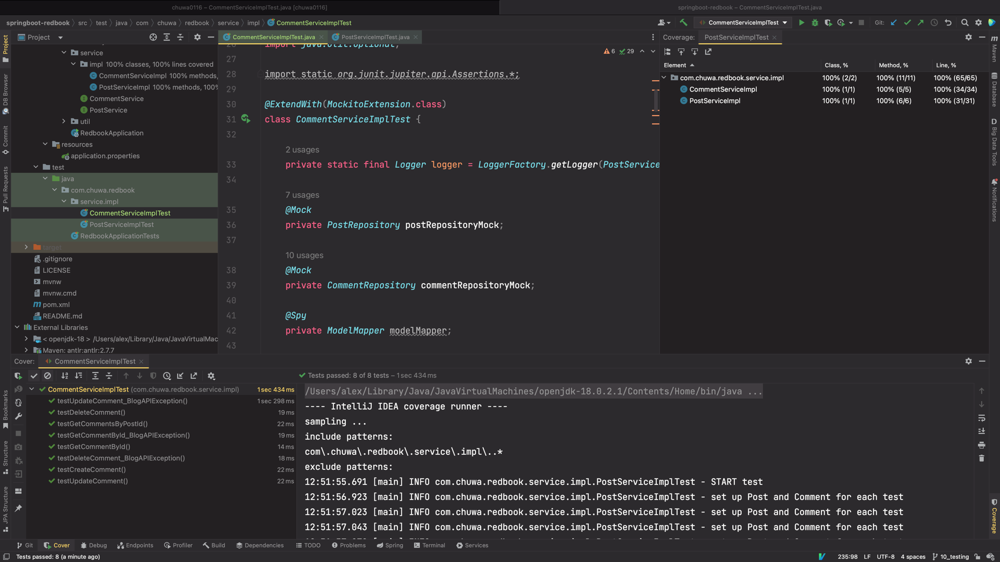

# hw47-testing-0308 - Hao Jia

### List all of the new learned annotations to your annotations.md

### what is selenium(YouTube)?
    * Selenium is used for automating web applications for testing purposes, it simulates the user behaviors such as
      clicking, sliding, log in, fill out forms, etc.
### what is cucumber(YouTube)?
    * Cucumber is also one of the software testing process in a behavior-driven development (BDD) style. It starts with
      simple natual language that anyone can understand and therefore make the testing process more intuitive and easy
      to understand even if the people reading it are not technical experts.
### what is JMeter(YouTube)?
    * JMeter is an open-source source software that can analyze and measure the performance of the application or a
      variety of services.
### what is unit-test?
    * A unit test is often performed on the smallest piece of code that can be logically isolated in a system or software.
      A unit normally refers to a function, or a subroutine, or a method or property
### What is the lifecycle of Junit?
    1. `@BeforeAll`: provides class level set-up
    2. `@BeforeEach`: provides method level set-up
    3. `@Test`: test execution and assertion happens
    4. `@AfterEach`: provides method level clean-up
    5. `@AfterAll`: provides class level clean-up
### Is @BeforeAll method should be Class level(static)?
    * Yes, `@BeforeAll` should annotate static method, therefore the method is class level
### What is Mockito? and what is its limitations?
    * Mockito provides a framework that can mock objects with the help of Java's Reflection API, therefore we can
      separate the function we want to test in JUnit test from other functions that are invoked in JUnit and don't
      need testing.
### What is @Mock and what is @InjectMocks?
    * `Mock`: The @Mock annotation is used to create and inject mocked instances. We do not create real objects,
      rather ask mockito to create a mock for the class.
    * `InjectMocks`: the service being annotated with this will be provided with other mocked methods that it depends on.
### What is the stubbing?
    * A stub is a controllable replacement for an existing dependency (or collaborator) in the system.
      By using a stub, you can test your code without dealing with the dependency directly.
### what is Mockito ArgumentMatchers
    * Argument matchers are mainly used for performing flexible verification and stubbing in Mockito. It extends
      ArgumentMatchers class to access all the matcher functions.
### what is Hamcrest Matchers
    * Hamcrest is a framework for writing matcher objects allowing 'match' rules to be defined declaratively, such as
      UI validation or data filtering
### do you know @spy? what is difference between @spy and @Mock?
    * `@spy`: is a partial mock object that mock part of the object
    * `@Mock`: is a normal mock object that allows you to stub invocations
### briefly reading this articles
    a. https://www.javatpoint.com/examples-of-mockito-and-junit-in-eclipse
    -ide
    b. https://www.javatpoint.com/junit-tutorial
    c.  https://www.javatpoint.com/testng-tutorial
    d.  https://www.javatpoint.com/jmeter-tutorial
### Add unit test for CommentServiceImpl, the coverage should be 100%.
    * See `Coding/hw47-test/CommentServiceImplTest.java` file for code, `Coding/hw47-test/img.png` for coverage report
    * Below is the coverage report
    * 
 

