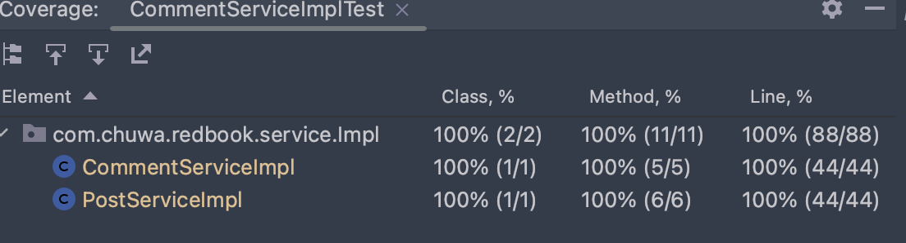

#  hw47-testing-0308

### 1 List all of the new learned annotations to your annotations.md

### 2 what is selenium(YouTube)?

Selenium is an open-source automated testing tool that is used to automate web browsers. It allows developers and testers to write test scripts in various programming languages such as Java, Python, C#, Ruby, and others, to automate interactions with web applications.

Selenium is widely used for web application testing because it provides a range of features, including:

- Cross-browser testing: Selenium supports multiple browsers, including Chrome, Firefox, Safari, and Internet Explorer, allowing testers to ensure that their application works correctly across different platforms.
- Testing for web applications: Selenium provides APIs to interact with web elements, such as clicking on links, entering text into forms, and checking the presence of specific elements on a web page.
- Integration with other testing tools: Selenium can be integrated with other testing tools such as TestNG, JUnit, and Jenkins, to provide a complete testing solution.

Overall, Selenium is a powerful tool for automating web browser interactions, helping developers and testers to identify and fix issues in web applications more efficiently.

### 3 what is cucumber(youtuebe)?

Cucumber is a software testing tool that is used for behavior-driven development (BDD). It allows developers and testers to write tests in plain language that can be easily understood by all stakeholders, including business analysts, product owners, and developers.

Cucumber uses the Gherkin syntax to write tests in a structured way. Gherkin is a simple language that is easy to read and write, and it helps to ensure that everyone is on the same page when it comes to what is being tested.

Cucumber provides a framework for writing and running automated tests, and it integrates with a variety of programming languages, including Java, Ruby, and JavaScript. It also integrates with other testing tools such as Selenium and Appium, making it a powerful tool for testing web and mobile applications.

Overall, Cucumber is a useful tool for teams that practice BDD, as it helps to ensure that everyone has a clear understanding of the behavior that is expected from the software. It also helps to improve collaboration and communication between stakeholders, leading to better-quality software.

### 4 what is JMeter(youtube)?

JMeter is an open-source software testing tool that is used to load test and measure the performance of web applications, databases, and other network services. It is developed in Java and provides a user-friendly GUI for creating and executing load tests.

JMeter simulates a large number of virtual users, called threads, to measure how an application or service performs under different load conditions. It can also be used to test functional behavior, as it can simulate user interactions with web pages and web services.

JMeter supports a variety of protocols, including HTTP, HTTPS, FTP, JDBC, SOAP, and others, making it a versatile tool for testing different types of applications and services.

JMeter allows testers to generate various types of reports, including graphs, tables, and charts, to help identify performance issues and bottlenecks in the system. It also provides several plugins that can be used to extend its functionality, such as the WebDriver Sampler plugin, which allows users to use JMeter with Selenium to test web applications.

Overall, JMeter is a powerful tool for load testing and performance testing, making it a valuable asset for software development teams looking to improve the quality and reliability of their applications.

### 5 what is unit-test?

Unit testing is a software testing technique where individual units or components of a software application are tested in isolation to ensure that they work correctly. The purpose of unit testing is to verify that each unit of code performs as expected, and to identify and fix any defects early in the development cycle.

Unit tests are typically written by developers and are automated tests that can be run frequently and easily. They are designed to test small pieces of code, such as functions or methods, in isolation from the rest of the application.

Unit tests are usually written using a testing framework, such as JUnit for Java, NUnit for .NET, or pytest for Python. These frameworks provide a set of methods and tools for writing and running tests, and for reporting on the results.

Unit tests are usually written using a testing framework, such as JUnit for Java, NUnit for .NET, or pytest for Python. These frameworks provide a set of methods and tools for writing and running tests, and for reporting on the results.

The benefits of unit testing include:

- Early defect detection: Unit tests can identify defects early in the development cycle, before they become more expensive and time-consuming to fix.
- Better code quality: Unit testing encourages developers to write cleaner, more modular code that is easier to maintain and extend.
- Faster development: Automated unit tests can be run quickly and easily, allowing developers to make changes with confidence.
- Documentation: Unit tests serve as documentation for the code, providing examples of how it should be used and what it should do.

Overall, unit testing is an essential part of the software development process, helping to ensure that code works as expected and is of high quality.

### 6 What is the lifecircle of Junit?

The lifecycle of JUnit is the sequence of events that occur when running JUnit tests. It can be broken down into several steps:

1. Test Setup: In this step, the test environment is set up, including any necessary resources or dependencies.
2. Test Execution: In this step, the actual test code is executed. JUnit provides a set of methods for writing and running tests, including assertions to check the expected behavior of the code.
3. Test Teardown: In this step, the test environment is cleaned up and any resources or dependencies that were created during setup are released.
4. Test Reporting: In this step, the results of the tests are reported. JUnit provides a set of tools for generating reports and analyzing test results.

The JUnit lifecycle is typically repeated for each test case, where a test case is a collection of related tests that are executed together. JUnit provides annotations, such as `@Before`, `@Test`, and `@After`, that can be used to control the order in which the lifecycle steps are executed and to specify any necessary setup or teardown code.

Overall, the JUnit lifecycle ensures that tests are executed consistently and reliably, helping to identify and fix defects early in the development cycle.

### 7 Is @BeforeAll method should be Class level(static)?

Yes, the `@BeforeAll` method in JUnit should be declared as a static method at the class level.

The `@BeforeAll` annotation is used to denote a method that should be executed once before all tests in a test class are run. This method is typically used for setup tasks that only need to be performed once, such as initializing shared resources or creating a database connection.

By declaring the `@BeforeAll` method as static, JUnit ensures that the method is executed only once, regardless of the number of instances of the test class that are created. This is important because it ensures that the setup tasks are not repeated unnecessarily, which can lead to inefficiencies or errors.

Additionally, by declaring the `@BeforeAll` method as static, JUnit ensures that the method can be called without an instance of the test class being created. This is necessary because the method is executed before any instances of the test class are created.

Overall, declaring the `@BeforeAll` method as a static method at the class level is a best practice in JUnit and ensures that the setup tasks are executed correctly and efficiently.

### 8 What is Mockito? and what is its limitations?

Mockito is a popular open-source Java testing framework used for mocking and testing Java code. It allows developers to create mock objects of classes and interfaces, which can be used to simulate behavior and dependencies of real objects during unit testing.

Mockito provides a simple and intuitive API that makes it easy to create and configure mock objects. It also supports a wide range of testing scenarios, including method call verification, stubbing, and argument matching.

Some of the main features of Mockito include:

- Ability to mock interfaces and classes
- Method call verification
- Stubbing of method calls
- Argument matching
- Supports annotations such as `@Mock`, `@InjectMocks`, and `@Spy` for configuring mock objects

Limitations of Mockito:

- Mockito cannot mock final classes, static methods, or final methods by default. However, this limitation can be overcome by using alternative techniques, such as using a different mocking library or modifying the code to make it more testable.
- Mockito may not be suitable for testing complex systems that have a large number of dependencies or that require testing of interactions between different components. In such cases, it may be necessary to use more advanced testing frameworks or to write integration tests.
- Mockito may not be suitable for testing asynchronous or multithreaded code, as it does not provide built-in support for handling such scenarios. However, there are alternative libraries and techniques that can be used to test such code.

Overall, Mockito is a powerful and flexible testing framework that can be used to create mock objects and simulate behavior during unit testing. However, like any testing framework, it has its limitations and may not be suitable for all testing scenarios.

### 9 What is @Mock and what is @InjectMocks? 

`@Mock` and `@InjectMocks` are annotations used in the Mockito framework to create and configure mock objects for use in testing.

`@Mock` annotation is used to create a mock object for a class or interface. When the `@Mock` annotation is used on a field, Mockito creates a mock object of the specified type and injects it into the test class. The mock object can then be configured and used to simulate the behavior of a real object during testing.

`@InjectMocks` is used to inject mock objects into the class being tested. It is typically used in combination with `@Mock` to inject the mock objects into the class being tested. The `@InjectMocks` annotation can be applied to a field, and Mockito will automatically inject the mock objects into the corresponding fields of the class being tested.

Note that `@InjectMocks` works by matching the mock objects created using `@Mock` to the fields in the class being tested based on their types. If a matching field is not found, Mockito will throw an exception.

### 10 What is the stubbing?

In software testing, stubbing is a technique used to simulate the behavior of a software component by replacing its dependencies with predefined responses or behavior. It is commonly used in unit testing to isolate the code being tested from its dependencies, such as external services or databases.

When stubbing, developers create mock objects that mimic the behavior of the real objects or services that the code being tested relies on. These mock objects can be configured to return predefined responses or to simulate expected behavior, such as throwing exceptions or delaying responses.

The process of defining the behavior of a mock object is called stubbing. It typically involves setting up expectations for the inputs and outputs of the method being stubbed. For example, in a test for a shopping cart application, a developer might stub a call to a payment service to always return a success response, allowing the test to focus on the behavior of the shopping cart code without worrying about the details of payment processing.

### 11 what is Mockito ArgumentMatchers

Mockito ArgumentMatchers is a utility class in the Mockito testing framework that provides a set of methods for matching method arguments when configuring mock objects or verifying method calls during testing.

ArgumentMatchers provides a range of methods for matching arguments based on their values or types. For example, some of the commonly used ArgumentMatchers methods include:

- `any()`: Matches any value of the corresponding type.
- `eq()`: Matches a value that is equal to the given value.
- `anyInt()`, `anyString()`, `anyBoolean()`, etc.: Matches any value of the corresponding type.
- `isNull()`: Matches a null value.
- `isNotNull()`: Matches a non-null value.
- `startsWith()`, `endsWith()`, `contains()`: Matches a string that starts with, ends with, or contains the given substring.

When configuring a mock object or verifying a method call using Mockito, developers can use ArgumentMatchers to specify the expected arguments for a method call. For example:

```java
when(mockObject.method(anyString(), anyInt())).thenReturn(expectedResult);

verify(mockObject).method(eq("example"), anyInt());
```

In the above example, `anyString()` and `anyInt()` are used to match any string and integer values, respectively, when configuring the mock object. When verifying the method call, `eq("example")` is used to match a string value that is equal to "example".

Overall, Mockito ArgumentMatchers provides a convenient way to match method arguments during testing, making it easier to write and maintain unit tests. By using ArgumentMatchers, developers can specify the expected behavior of a method call without having to hard-code specific argument values.

### 12 what is Hamcrest Matchers

Hamcrest Matchers is a library of matchers for testing frameworks, including JUnit and Mockito. Hamcrest provides a set of assertion methods that are more expressive and readable than the default assertions provided by these frameworks.

Hamcrest Matchers provides a range of matchers for various types of objects and values. Some examples of commonly used Hamcrest Matchers include:

- `is()`: Checks whether a value is equal to another value.
- `not()`: Checks whether a value is not equal to another value.
- `containsString()`: Checks whether a string contains a given substring.
- `hasSize()`: Checks whether a collection has a specific size.
- `equalToIgnoringCase()`: Checks whether a string is equal to another string, ignoring case.

Hamcrest Matchers are typically used in combination with testing frameworks like JUnit and Mockito to provide more expressive and readable test assertions. For example:

```java
import static org.hamcrest.MatcherAssert.assertThat;
import static org.hamcrest.Matchers.*;

...

@Test
public void testExample() {
    List<String> list = Arrays.asList("foo", "bar", "baz");
    assertThat(list, hasSize(3));
    assertThat(list, containsInAnyOrder("bar", "baz", "foo"));
}
```

In the above example, Hamcrest Matchers are used to assert that the `list` object has a size of 3 and contains the values "bar", "baz", and "foo" in any order.

Overall, Hamcrest Matchers provides a powerful and expressive way to write assertions in unit tests, making it easier to read and understand the intent of the tests.

### 13 do you know @spy? what is difference between @spy and @Mock?

`@Mock` is used to create a mock object of a class or interface, and it replaces the real object in the test. This means that all method calls on the mock object will return default values, unless you explicitly specify the behavior of the mock object using `when()` method.

On the other hand, `@Spy` is used to create a partial mock object of a real class. The partial mock object retains the original behavior of the real object, but allows you to specify the behavior of specific methods using the `doReturn()`, `doThrow()`, `doCallRealMethod()`, etc. methods.

So, the main difference between `@Mock` and `@Spy` is that `@Mock` creates a completely new mock object that does not retain any of the original behavior of the real object, while `@Spy` creates a partial mock object that retains the original behavior of the real object.

### 14 briefly reading this articles

​	a. https://www.javatpoint.com/examples-of-mockito-and-junit-in-eclipse-ide
​	b. https://www.javatpoint.com/junit-tutorial
​	c.  https://www.javatpoint.com/testng-tutorial
​	d.  https://www.javatpoint.com/jmeter-tutorial	

### 15 Add unit test for CommentServiceImpl, the coverage should be 100%.

 