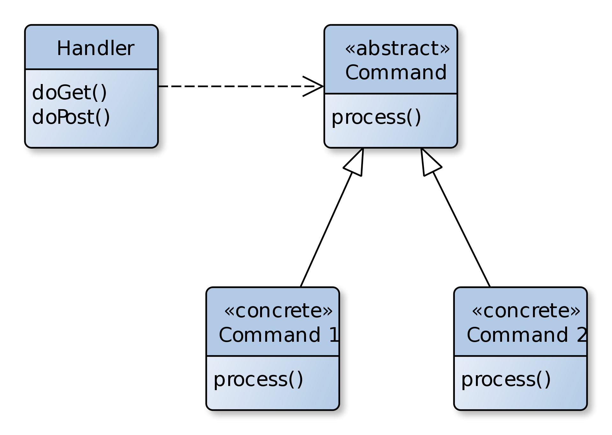

1. list all of the new annotations you learned to your annotations.md

2. Document the microservice architeture and components/tools/dependencies
3. What are Resilience patterns? What is circuit breaker?
   Resilience patterns are software design patterns that are used to improve the fault tolerance and reliability of distributed systems. These patterns are focused on improving the ability of systems to handle and recover from failures.

    One common resilience pattern is the circuit breaker pattern. The circuit breaker pattern is used to prevent repeated calls to a remote service that has failed or is experiencing high latency. The pattern provides a way to handle the failure of the service gracefully, rather than allowing the failure to propagate and potentially cause more damage to the system.

    The circuit breaker pattern works by introducing a circuit breaker object that is placed between the client and the remote service. The circuit breaker monitors the calls to the remote service and tracks the success rate and response times. If the number of failed requests or the response times exceed a certain threshold, the circuit breaker trips and begins to short-circuit the requests to the remote service. This means that any subsequent requests to the service will not be executed and will be returned immediately with a predefined error response.

    The circuit breaker pattern helps to improve the resilience of distributed systems by preventing cascading failures that can occur when a service is unavailable or experiencing high latency. By using the circuit breaker pattern, developers can ensure that their systems are more robust and can recover from failures more quickly and effectively.
4.  Read this article, then list the important questions, then write your answers
a. https://www.interviewbit.com/microservices-interview-questions/#mai
n-features-of-microservices
* Write main features of Microservices.

    * Decoupling: Within a system, services are largely decoupled. The application as a whole can therefore be easily constructed, altered, and scalable
    * Componentization: Microservices are viewed as independent components that can easily be exchanged or upgraded
    * Business Capabilities: Microservices are relatively simple and only focus on one service 
    * Team autonomy: Each developer works independently of each other, allowing for a faster project timeline 
    * Continuous Delivery: Enables frequent software releases through systematic automation of software development, testing, and approval 
    * Responsibility: Microservices are not focused on applications as projects. Rather, they see applications as products they are responsible for 
    * Decentralized Governance: Choosing the right tool according to the job is the goal. Developers can choose the best tools to solve their problems 
    * Agility: Microservices facilitate agile development. It is possible to create new features quickly and discard them again at any time.

* Write main components of Microservices.
  * Containers, Clustering, and Orchestration 
  * IaC [Infrastructure as Code Conception]
  * Cloud Infrastructure 
  * API Gateway 
  * Enterprise Service Bus 
  * Service Delivery
* What are the benefits and drawbacks of Microservices?
  Benefits:
  * Scalability: Microservices architecture allows for the individual services to be scaled up or down as needed, which can help to increase the overall scalability of the system. 
  * Flexibility: Microservices architecture allows for the use of different programming languages, frameworks, and technologies, which can help to increase the flexibility of the system. 
  * Resilience: Microservices architecture provides resilience and fault tolerance, as failures in one service do not affect the entire system. 
  * Independent development: Microservices architecture allows for individual services to be developed, tested, and deployed independently of each other, which can help to increase the speed of development. 
  * Decentralized governance: Microservices architecture allows for independent teams to work on individual services, which can help to increase innovation and reduce bottlenecks. 
  * Continuous delivery: Microservices architecture supports continuous delivery, which allows for new features and updates to be delivered more quickly and efficiently.
    Drawbacks:
  * Complexity: Microservices architecture can be complex to design and implement, as there are many components to manage and coordinate. 
  * Increased overhead: Microservices architecture requires additional infrastructure and resources to manage, which can increase the overhead of the system. 
  * Distributed systems: Microservices architecture is a distributed system, which can make it difficult to manage and troubleshoot. 
  * Integration challenges: Integrating different services can be a challenge, as they may use different protocols or technologies. 
  * Testing complexity: Testing individual services and the interactions between them can be complex, as there are many moving parts to manage.

* Name three common tools mostly used for microservices.
  * Wiremock
  * Docker
  * Hystrix
    
* Explain the working of Microservice Architecture.
  * Clients: Different users send requests from various devices. 
  * Identity Provider: Validate a user's or client's identity and issue security tokens. 
  * API Gateway: Handles the requests from clients. 
  * Static Content: Contains all of the system's content. 
  * Management: Services are balanced on nodes and failures are identified. 
  * Service Discovery: A guide to discovering the routes of communication between microservices. 
  * Content Delivery Network: Includes distributed network of proxy servers and their data centers. 
  * Remote Service: Provides remote access to data or information that resides on networked computers and devices.

* Write difference between Monolithic, SOA and Microservices Architecture.
  * Monolithic Architecture: It is "like a big container" where all the software components of an application are bundled together tightly.  It is usually built as one large system and is one code-base. 
  * SOA (Service-Oriented Architecture): It is a group of services interacting or communicating with each other. Depending on the nature of the communication, it can be simple data exchange or it could involve several services coordinating some activity.
  * Microservice Architecture: It involves structuring an application in the form of a cluster of small, autonomous services modeled around a business domain. The functional modules can be deployed independently, are scalable, are aimed at achieving specific business goals, and communicate with each other over standard protocols.

* Explain spring cloud and spring boot  
  * Spring Boot is an opinionated framework that simplifies the process of building stand-alone, production-ready applications. It provides a set of preconfigured modules that make it easy to get started with Spring, such as embedded servers, metrics, health checks, and more. Spring Boot is designed to help developers focus on writing business logic, rather than configuring and integrating multiple libraries and frameworks.
  * Spring Cloud, on the other hand, is a set of tools and frameworks for building cloud-native applications. It provides a set of tools for building distributed systems and microservices-based architectures, such as service discovery, circuit breakers, configuration management, and more. Spring Cloud builds on top of Spring Boot and adds additional features that are necessary for building scalable, fault-tolerant distributed systems.

* What is the role of actuator in spring boot?  
  * Health endpoint: Provides basic application health information such as whether the application is up or down. 
  * Metrics endpoint: Provides metrics for the application, such as memory usage, CPU usage, and other application-specific metrics. 
  * Loggers endpoint: Allows you to view and configure logging levels for the application. 
  * Trace endpoint: Provides detailed request tracing information for the application. 
  * Info endpoint: Provides application-specific information such as version number, build timestamp, etc.
* Explain how you can override the default properties of Spring boot projects.
  * specifying properties in the application.properties file

* What issues are generally solved by spring clouds?
  * Complicated issues caused by distributed systems: This includes network issues, latency problems, bandwidth problems, and security issues. 
  * Service Discovery issues: Service discovery allows processes and services to communicate and locate each other within a cluster. 
  * Redundancy issues: Distributed systems can often have redundancy issues. 
  * Load balancing issues: Optimize the distribution of workloads among multiple computing resources, including computer clusters, central processing units, and network links.
  * Reduces performance issues: Reduces performance issues caused by various operational overheads.

* What do you mean by Cohesion and Coupling?
  * Cohesion refers to the degree to which the elements within a module or component are functionally related and work together to achieve a specific purpose or task. High cohesion means that the elements within a module are highly related and work closely together, while low cohesion means that the elements within a module are loosely related and may not work well together. 
  * Coupling, on the other hand, refers to the degree to which different modules or components in a system are dependent on each other. High coupling means that modules are highly dependent on each other, while low coupling means that modules are relatively independent of each other.

* What do you mean by Bounded Context?
  * Bounded Context is a concept in Domain-Driven Design (DDD) that defines a clear boundary within which a particular domain model is applicable. It refers to the idea that a model and its components (classes, methods, properties, etc.) should only exist and be defined within a specific context or bounded area of the system.
  
* Write the fundamental characteristics of Microservice Design.
  * Based on Business Capabilities: Services are divided and organized around business capabilities. 
  * Products not projects: A product should belong to the team that handles it.
  * Essential messaging frameworks: Rely on functional messaging frameworks: Eliminate centralized service buses by embracing the concept of decentralization。
  * Decentralized Governance: The development teams are accountable for all aspects of the software they produce.
  * Decentralized data management: Microservices allow each service to manage its data separately.
  * Automated infrastructure: These systems are complete and can be deployed independently.
  * Design for failure: Increase the tolerance for failure of services by focusing on continuous monitoring of the applications.
* What are the challenges that one has to face while using Microservices? 
  * Distributed System Complexity: In a Microservices architecture, the system is distributed across multiple services, which makes it more complex to manage and debug. 
  * Service Coordination: As Microservices communicate with each other over the network, it is essential to have a robust service coordination mechanism in place. 
  * Data Management: Managing data consistency and integrity across multiple services is a challenging task in a Microservices architecture. 
  * Continuous Deployment: As there are multiple services, each with its own codebase and deployment process, it becomes challenging to manage the continuous deployment process. 
  * Testing: Testing a Microservices architecture requires a different approach compared to monolithic architecture, which involves testing each service in isolation and also as part of the integrated system. 
  * Security: In a Microservices architecture, security is a significant concern, as there are multiple services communicating over the network. 
  * Governance: Managing governance policies, service contracts, and service-level agreements (SLAs) is challenging in a Microservices architecture.

* Explain PACT in microservices.
  * PACT is a contract testing framework used in microservices architecture. It enables testing of communication between microservices by creating a mock service that behaves like the actual service. PACT helps in ensuring that the microservices are communicating correctly by verifying that the response from the actual service matches the expected response.
* Explain how independent microservices communicate with each other.  
In a microservices architecture, each service is designed to be independent and responsible for a specific business capability. These services communicate with each other to accomplish a larger goal. There are different ways in which microservices can communicate with each other, including:
  * Synchronous communication: In this approach, a microservice sends a request to another microservice and waits for a response. This can be done using REST APIs, where the response is returned in a JSON format. 
  * Asynchronous communication: In this approach, a microservice sends a message to another microservice without waiting for a response. This can be done using message brokers like RabbitMQ or Apache Kafka. 
  * Service discovery: In a microservices architecture, there can be multiple instances of a service running at any given time. Service discovery helps in identifying the right instance to communicate with. This can be done using tools like Eureka, Consul or ZooKeeper. 
  * API gateway: An API gateway can be used to provide a single entry point for all microservices. The API gateway can handle authentication, routing and load balancing between the microservices.

* What do you mean by client certificates?
  * Client certificates are digital certificates that are used to authenticate the client or the user attempting to access a resource or service. These certificates are issued by a trusted certificate authority and are used to provide an extra layer of security to the communication process.
* Explain CDC.
  * CDC stands for Change Data Capture. It is a software design pattern used to capture changes made to data in a database and propagate them to other systems or applications in real-time. CDC is commonly used in distributed systems and microservices architecture, where data is often spread across multiple databases and applications.
* Name some famous companies that use Microservice architecture.
  * amazon, twitter

 3. how to do load balance in microservice? Write a long Summary by yourself.  
    Load balancing in microservices is the process of distributing incoming network traffic across multiple instances of a service. This helps to ensure that requests are handled efficiently and that no single instance of a service becomes overwhelmed with traffic.

    There are several ways to implement load balancing in microservices. One common approach is to use a load balancer, which is a dedicated piece of hardware or software that sits between the clients and the services. The load balancer receives incoming requests and then forwards them to one of the available instances of the service. This allows the load balancer to distribute the traffic evenly across the instances and ensures that each instance is used effectively.

    Another approach to load balancing in microservices is to use a service mesh. A service mesh is a dedicated infrastructure layer that provides service-to-service communication within a microservices architecture. It can be used to handle load balancing as well as other tasks such as traffic management, service discovery, and security.

    In addition to load balancing, there are other techniques that can be used to improve the scalability and performance of microservices. For example, caching can be used to store frequently accessed data so that it can be retrieved more quickly. Service auto-scaling can be used to automatically increase or decrease the number of instances of a service based on the current level of traffic.

    Overall, load balancing is a critical component of any microservices architecture. By distributing traffic evenly across instances, load balancing helps to ensure that requests are handled efficiently and that services remain available and responsive. There are several approaches to load balancing in microservices, including using a load balancer or a service mesh, and other techniques such as caching and service auto-scaling can be used to further improve performance and scalability.
a. https://www.geeksforgeeks.org/load-balancer-system-design-interview
-question/
b. https://www.fullstack.cafe/blog/load-balancing-interview-questions
 4. Udemy: Theory + CLI