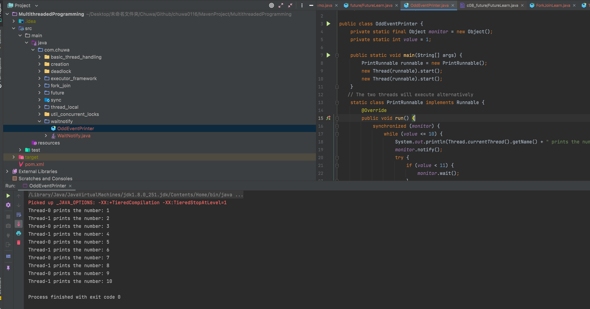
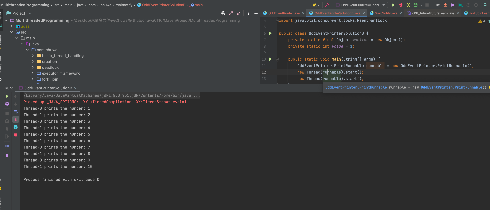

## Homework

name: Zijun Zhou

##### 1. Explain volatile variables in java? (we also use it in Singleton)
Volatile could be only used with the variables, we could not declare class or method as volatile. It's used to solve the visibility of variables between different threads, and it will force different threads to read variables directly from the main memory instead of CPU caches, in this way, each thread could get the up-to-date variable value.

##### 2. how to create a new thread(Please also consider Thread Pool case)?
We can create a thread extened class, and then invoke start() method so that a thread would be started. We could also pass in a class implementing Runnable interface to the thread constructor, and then invoke the start() in thread. For the thread pool, we could first initialize different kinds of thread pools by invoking the static methods of Executors. Then, we could create an object which implements the Runnable interface, and then submit it to the submit(Runnable runnable) method of the thread pool so that a worker thread would be scheduled to execute that task.

##### 3. Difference between Runnable and Callable
A callable interface throws the checked exception and returns the result. A runnable interface, on the other hand, does not return a result and cannot throw a checked exception.

##### 4. what is the diff between t.start() and t.run()?
Actually, t.start() could not be invoked multiple times, because it would throw illegalStateException, however, t.run() just behaves like the normal function in our class, we could invoke it multiple times.


##### 5. Which way of creating threads is better: Thread class or Runnable interface?
Implementing the Runnable Interface would be better, because this could make your code decoupled, in addition, we could define a class implementing runnable interface, but at the same time, we could make that class extends other classes if we like, therefore, Runnable interface would be better.

##### 6. what is the thread status?
The states of the threads are as follows: (It's stored in Thread.State enum class)
NEW:
This state represents that a thread is just initialized, and it's not yet started
RUNNABLE:
This state means that a thread has been submitted to JVM, and ready to be executed
BLOCKED:
This state means that the thread is currently waiting for the monitor lock 
WAITING:
This means that the thread would wait for another to wake it up by using notify() or notifyAll()
TIMED_WAITING:
Same as WAITING status, however, the thread would not wait perpetually, instead it will wait for a specified amount of time
TERMINATED:
This means that a thread has finished its life cycle, and it's finished the task

##### 7. difference between wait() and sleep() method
The key difference is that the thread would release its holding monitor lock while using wait(), however, the thread would not release its lock while using sleep()

##### 8. What is deadlock?
Deadlock arises with the situation in which two or more threads compete for the resources, one thread hold the resource that other thread wants, and waits for the resource that other thread holds, which would result in the threads blocked forever. Actually, deadlock has the following four conditions:
- Mutual Exclustion
- Hold and Wait
- No preemption
- Circular wait

##### 9. how do threads communicate with each other?
Actually, the threads in Java are mainly using wait() and notify() or notifyAll() to communicate with each other.

##### 10. what is join() method?
The t.join() in Java actually means that the main thread would wait for the another thread to finish its execution.

##### 11. what is yield() method
The yield() method is used in Java to hint the task scheduler to move the currently executing task to the Ready state and move another task or thread to the running state

##### 12. Explain thread pool
Java Thread pool represents a group of worker threads that are waiting for the job and reused many times.

##### 13. What is Executor Framework in Java, its different types and how to create these executors?
Actually, there are mainly four types of Executor frameworks in Java:
- SingleThreadExecutor:
This executor would only have one worker thread
```
ExecutorService executor = Executors.newSingleThreadExecutor();
```
- FixedPoolExecutor:
There will be a fixed amount of worker threads, which are responsible for executing the tasks submitted. However, if there happens to be more threads submitted, those threads would be stored in the LinkedBlockingQueue.
```
ExecutorService fixedPool = Executors.newFixedThreadPool(2);
```
- CachedThreadExecutor:
This is mainly used when there are multiple short-lived threads to execute. Therefore, the amount of threads is not limited, if you submit a task to execute, there happens to be all the worker threads actively executing, then, you could expect the thread pool to create a new thread for your task. If there exists a thread idle for a specific amount of time, it will be removed from the cache and terminated.
```
ExecutorService executorService = Executors.newCachedThreadPool();
```
- ScheduledExecutor:
This executor is used when you have a task that needs to be run at regular intervals or if in case you wish to delay a certain task. The tasks can be scheduled in ScheduledExecutor using either of the two methods scheduleAtFixedRate or scheduleWithFixedDelay.
```
ScheduledExecutorService scheduledExecService = Executors.newScheduledThreadPool(1);
```

##### 14. Difference between shutdown() and shutdownNow() methods of executor
Actually, invocation of shutdown() method would force the thread pool to enter a state of SHUTDOWN, which means the thread pool would not accept new tasks, however, it will still process the queued tasks. However, shutdownNow() would make the thread pool enter STOP state, which means that the thread pool would not only stop accepting new tasks, but also stop processing queued tasks.

##### 15. What is Atomic classes? when do we use it?
The atomic classes would provide developers with lock-free and thread-safe programming on the variables. If we try to create multiple threads, and those threads would share the same variables together, it would be better if we could utilize those atomic classes so that we could prevent the inefficient synchronized locks.

##### 16. What is the concurrent collections?
Actually, the common collections in JDK would not provide thread-safe programming for developers, instead, they could utilize the concurrent collcetions so that they could ensure the thread-safe environment.

##### 17. what kind of locks you know?
Actually, the common locks I know are as follows:
- Synchronized locks
- ReentrantLock
- ReadWriteLock
- Other locks implementing Lock interface

##### 18. What is the difference between class lock and object lock?
Object Level Locks − It can be used when you want non-static method or non-static block of the code should be accessed by only one thread. Class Level locks − It can be used when we want to prevent multiple threads to enter the synchronized block in any of all available instances on runtime.

##### 19. What is future and completableFuture?
A Future represents the result of an asynchronous computation. However, if we try to get the result of Future, it could make us potentially blocked, the CompletableFuture on the other hand would provide us with the non-blocking programming.

##### 20. what is ThreadLocal? 
The ThreadLocal class in Java allows programmers to create variables that are accessible only to the thread that created them. This is useful for creating thread-safe code, as it ensures that each thread has its own copy of a variable and can not interfere with other threads.

##### 21. Code Practice
Code is included in MavenProject directory

##### 22. Read those interview questions and pick some important questions to this homework.
What is callable? what is the diff between callable and runnable?
Callable is also an interface that implements the Runnable interface, however, in the overriden run() method, it would dynamically update the completing status, then when you invoke get() in the future object, the thread would actually wait for the current thread to complete

##### 23.
SolutionA:

We could see that the two threads print the number alternatively

SolutionB:
```
public class OddEventPrinterSolutionB {
	private static final Object monitor = new Object();
	private static int value = 1;

	public static void main(String[] args) {
		OddEventPrinter.PrintRunnable runnable = new OddEventPrinter.PrintRunnable();
		new Thread(runnable).start();
		new Thread(runnable).start();
	}
	// The two threads will execute alternatively
	static class PrintRunnable implements Runnable {
		private ReentrantLock reentrantLock = new ReentrantLock();
		private Condition condition = reentrantLock.newCondition();
		@Override
		public void run() {
			reentrantLock.lock();
			try {
				while (value <= 10) {
					System.out.println(Thread.currentThread().getName() + " prints the number: " + value++);
					condition.notify();
					try {
						if (value < 11) {
							condition.await();
						}
					} catch (InterruptedException e) {
						e.printStackTrace();
					}
				}
			}finally {
				reentrantLock.unlock();
			}
		}
	}
}
```
It could print the same result as above:

And the code is included in /MavenProject/MultithreadedProgramming/com/chuwa/waitnotify/OddEventPrinterSolutionB

##### 24. create 3 threads, one thread ouput 1-10, one thread output 11-20, one thread output 21-22. threads run sequence is random.
Actually, the provided solution used synchronized to solve this question, however, I will try to use the ReentrantLock to solve this:
```
package com.chuwa.last_question;

import java.util.concurrent.locks.ReentrantLock;

public class Solution {
	public static void main(String[] args) throws InterruptedException {
    Runnable runnable = new Task();
	Thread[] threads = new Thread[3];
	for(int i=0;i<3;++i)
		threads[i] = new Thread(runnable);
    for(int i=0;i<3;++i){
		threads[i].start();
    }
	for(int i=0;i<3;++i)
		threads[i].join();
	}
	static class Task implements Runnable{
		private ReentrantLock reentrantLock = new ReentrantLock();
        private int currentNumber=1;
		@Override
		public void run() {
        reentrantLock.lock();
		try{
			for(int i=0;i<10;++i){
				if(currentNumber>22)break;
				System.out.println(Thread.currentThread().getName()+" prints the number: "+currentNumber++);}
		}finally {
			reentrantLock.unlock();
		}
		}
	}
}
```
The result is as follows:

And the code is included in /MavenProject/MultithreadedProgramming/com/chuwa/last_question/Solution