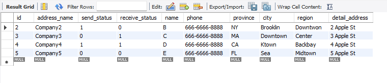

## DB_Practice

### MySQL
**1. Create oms_company_address table**
```mysql
CREATE TABLE oms_company_address(
    id               	bigint,
    address_name		varchar(200),
	send_status			int,
    receive_status 		int,
    name 				varchar(64),
    phone 				varchar(64),
    province 			varchar(64),
    city 				varchar(64),
    region 				varchar(64),
    detail_address 		varchar(200),
    CONSTRAINT id PRIMARY KEY NONCLUSTERED (id)
);
```

**2. Insert few random entries to oms_company_address table**
```mysql
INSERT INTO oms_company_address VALUES (1, 'Company1', 0, 0, 'A', '111-111-1111', 'MA', 'Boston', 'Fenway', '1 Apple St');
INSERT INTO oms_company_address VALUES (2, 'Company2', 1, 0, 'B', '121-111-1111', 'NY', 'Brooklin', 'Downtwon', '2 Apple St');
INSERT INTO oms_company_address VALUES (3, 'Company3', 0, 1, 'C', '131-111-1111', 'MA', 'Downtown', 'Center', '3 Apple St');
INSERT INTO oms_company_address VALUES (4, 'Company4', 1, 1, 'D', '141-111-1111', 'CA', 'Ktown', 'Backbay', '4 Apple St');
INSERT INTO oms_company_address VALUES (5, 'Company5', 0, 0, 'E', '151-111-1111', 'FL', 'Sea', 'Midtown', '5 Apple St');
```

**3.Write a SQL query to fetch all data from oms_company_address `table**
```mysql
SELECT * FROM oms_company_address;
```

**4. Write a SQL query to fetch top 3 records from oms_company_address table**
```mysql
SELECT * FROM oms_company_address ORDER BY id ASC limit 3;
```

**5. Update oms_company_address table to set all phone to 666-6666-8888**
```mysql
UPDATE oms_company_address SET phone = '666-6666-8888';

```
**6.Delete one entry from oms_company_address table**
```mysql
DELETE FROM oms_company_address WHERE id = 1;
```



### NoSQL
**1. Create test DB**
```mysql
use test
```

**2.Create oms_company_address collection (method: createCollection() )**
```mysql
db.createCollection("oms_company_address");
```

**3.Insert few random entries to oms_company_address collection (method: insert())**
```mysql
db.oms_company_address.insertOne({
    id: 1,
    address_name: 'Company1',
    send_status: 0,
    receive_status: 0,
    name: 'A',
    phone: '111-111-1111',
    province: 'MA',
    city: 'Boston',
    region: 'Fenway',
    detail_address: '1 Apple St'
});

db.oms_company_address.insertOne({
    id: 2,
    address_name: 'Company2',
    send_status: 1,
    receive_status: 0,
    name: 'B',
    phone: '121-111-1111',
    province: 'NY',
    city: 'Brooklin',
    region: 'Downtwon',
    detail_address: '2 Apple St'
});

db.oms_company_address.insertOne({
    id: 3,
    address_name: 'Company3',
    send_status: 0,
    receive_status: 1,
    name: 'C',
    phone: '131-111-1111',
    province: 'MA',
    city: 'Downtown',
    region: 'Center',
    detail_address: '3 Apple St'
});

db.oms_company_address.insertOne({
    id: 4,
    address_name: 'Company4',
    send_status: 1,
    receive_status: 1,
    name: 'D',
    phone: '141-111-1111',
    province: 'CA',
    city: 'Ktown',
    region: 'Backbay',
    detail_address: '4 Apple St'
});

db.oms_company_address.insertOne({
    id: 5,
    address_name: 'Company5',
    send_status: 0,
    receive_status: 0,
    name: 'E',
    phone: '151-111-1111',
    province: 'FL',
    city: 'Sea',
    region: 'Midtown',
    detail_address: '5 Apple St'
});
```

**4. Read one entry from oms_company_address collection (method: find() )**
```mysql
db.oms_company_address.findone();
```

**5.Read all entries from oms_company_address collection (method: find())**
```mysql
db.oms_company_address.find({});

```
**6.Update one entry from oms_company_address collection (method: update() or save() )**
```mysql
db.oms_company_address.updateMany({id: 1}, {$set: {phone: '666-6666-8888'}});
```

**7. Remove one entry from oms_company_address collection (method: remove() )**
```mysql
db.oms_company_address.deleteOne({id: 1});
```
