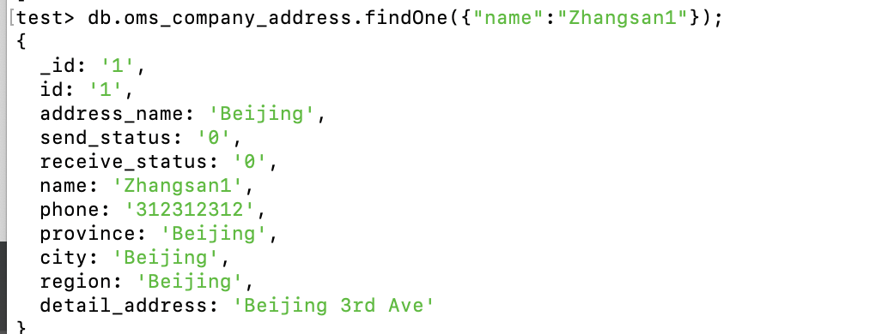
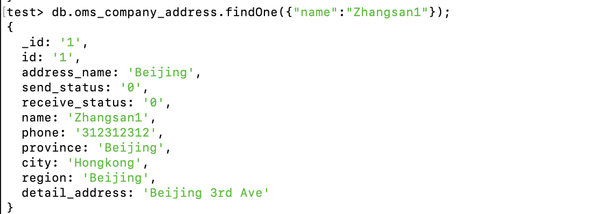

## Relational Database

Name: Zijun Zhou

##### 1. Create oms_company_address  table
```
create table oms_company_address(
id bigint primary key,
address_name varchar(200),
send_status int(1),
receive_status int(1),
name varchar(64),
phone varchar(64),
province varchar(64),
city varchar(64),
region varchar(64),
detail_address varchar(200)
);
```
##### 2. Insert some random data to `oms_company_address table`
```
insert into oms_company_address values(1,'Beijing',0,0,'Zhangsan','123123','Beijing','Beijing','Beijing','Beijing Ave');
insert into oms_company_address values(2,'Hongkong',0,0,'Wangwu','123123','Hongkong','Hongkong','Quanwang','Lijing');
insert into oms_company_address values(3,'Shanxi',0,0,'Liwu','123123','Shanxi','Taiyuan','North China','Chuntianhuayuan');
insert into oms_company_address values(4,'Hebei',0,0,'TuanzhangLiang','123123','Heibei','Jizhou','North China','Yangguang Ave');
insert into oms_company_address values(5,'Japan',0,0,'Jack Liang','123123','Japan','Daban','Riben','Riben Street');
```

##### 3. Write a SQL query to fetch all data from `oms_company_address` table
```
select * from oms_company_address;
```

##### 4. Write a SQL query to fetch top 3 records from  `oms_company_address`  table
```
select * from oms_company_address limit 3
```

##### 5. Update `oms_company_address` table to set all `phone` to 666-6666-8888
```
update oms_company_address set phone = '666-6666-8888';
```

##### 6. Delete one entry from  oms_company_address  table
```
delete from oms_company_address where id = 1;
```

## NoSql Database

##### 1. Create `test` DB
```
use test
```

##### 2.Create `oms_company_address`  collection  (method: createCollection() )
```
db.createCollection('oms_company_address')
```

##### 3. Insert few random entries to  oms_company_address  collection (method: insert() )

We could see that after executing the following command in the terminal, we could successfully see the results above
```
db.oms_company_address.insertMany([ {"_id":"1","id":"1","address_name":"Beijing","send_status":"0","receive_status":"0","name":"Zhao","phone":"312312312","province":"Beijing","city":"Beijing","region":"Beijing","detail_address":"BJ"},
{"_id":"2","id":"2","address_name":"Beijing","send_status":"0","receive_status":"0","name":"Qian","phone":"888888888","province":"Beijing","city":"Beijing","region":"Beijing","detail_address":"BJ"},
{"_id":"3","id":"3","address_name":"Beijing","send_status":"0","receive_status":"0","name":"Sungi","phone":"888888888","province":"Beijing","city":"Beijing","region":"Beijing","detail_address":"BJ"}]);
```

##### 4. Read one entry from `oms_company_address` collection (method: find() )

```
db.oms_company_address.findOne({"name":"Zhangsan1"});
```

##### 5. Read all entries from `oms_company_address` collection (method: find() )

```
db.oms_company_address.find();
```

##### 6. Update one entry from `oms_company_address` collection (method: update() or save() )
```
db.oms_company_address.update({"name":"Zhangsan1"},{$set:{"city":"Hongkong"}})
```
And the change has been successfully applied:

##### 7. Remove one entry from `oms_company_address` collection (method: remove() )
```
db.oms_company_address.remove({"name":"Zhangsan2"});
```