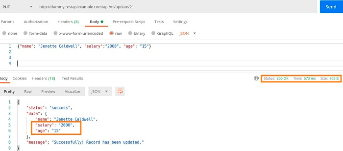

# part 1
## REST API
### 5 GET APIs with different response type
JSON,XML,YAML,CSV,HTML
### 5 Post API with json request body, please also paste the response here
POST https://reqres.in/api/users
<p>request body

```json
{
   "name": "morpheus",
   "job": "leader"
}
```
response 
```json
{
    "name": "morpheus",
    "job": "leader",
    "id": "9",
    "createdAt": "2023-02-03T22:29:22.804Z"
}
```

### 3 PUT API with json request body, please also paste the response here


### Each example with 404, 401,500 and any http status codes you know
- 400 Bad Request : The request was invalid
- 401 Unauthorized :The request requires user authentication.
- 500 Internal Server Error :An error occurred on the server while processing the request.


## API Design
### 1.  Find 2 collection of APIs example. ie. Twitter, Paypal, Youtube etc.  -- 命名规范
linkedin api
```
index GET https://www.linkedin.com/feed/
recommended job GET https://www.linkedin.com/jobs/collections/recommended/?currentJobId={id}
```
twitter api
```
create POST https://api.twitter.com/graphql/{id}/CreateTweet
delete OPTIONS https://api.twitter.com/graphql/{id}/DeleteTweet
```

### 2.  Design a collection of APIs for a Blog Website, please specify GET POST PUT DELETE
```
GET  api/v1/users/{id}/blogs        //get specified user`s all blogs list
GET  api/v1/users/{id}/blogs/{id}    //get specified user`s one blog
POST api/v1/users/{id}/blogs         //post one blog
PUT  api/v1/users/{id}/blogs/{id}    //update blog
Delete api/v1/users/{id}/blogs/{id}  //delete a blog
```

## Design APIs for the following features (思考：path variable 怎么用？有sub resources, 哪些地方该用复数)
### 1.  find the customer's payments, like credit card 1, credit card 2, paypal, Apple Pay.
```
 api/v1/customers/{id}/payments/{payment-typeid}
```
### 2.  Find the customer's history orders from 10/10/2022 to 10/24/2022
```
 api/v1/customers/{id}/orders?startdate=10102022&enddate=10242022
```
### 3.  find the customer's delievery  addresses
```
 api/v1/customers/{id}/adresses
```
### 4.  If I also want to get customer's default payment and default delievery address, what kind of the API (URL) 
```
 api/v1/customers/{id}/adresses/default
 api/v1/customers/{id}/payments/default
 
 or
 
 api/v1/customers/{id}/default?type=adresses
 api/v1/customers/{id}/default?type=payment
```
# part 2
## spring-boot
### 2.  explain how the below annotaitons specify the table in database?
```java
@Column(columnDefinition = "varchar(255) default 'John Snow'")   //It specifies that the field is of type varchar in the database. The length is 255 and the default value is John Snow.
private String name;
  
@Column(name="STUDENT_NAME", length=50, nullable=false, unique=false)  //It specifies the name of this field in the database as STUDENT_NAME, with a size of 50，it cannot be null, and can be repeated
private String studentName;

```
### 3.  What is the default column names of the table in database for  @Column ?
```java
@Column
private String firstName;
@Column
private String operatingSystem
```
first_name<br>
operating_system
### 4.  What are the layers in springboot application? what is the role of each layer?
**Controller(presentation layer)**: This layer is responsible for handling incoming requests and returning appropriate responses.  It maps HTTP requests to methods in the application and sends HTTP responses back to the client.<br>
**Service(business layer)**: The service layer contains the business logic of the application.  It interacts with the repository layer to retrieve and persist data.<br>
**Repository(persistence layer)**: This layer is responsible for interacting with the database to store and retrieve data.  It uses the Object-Relational Mapping (ORM) framework, such as Hibernate or JPA, to map objects to database tables .<br>
**database**: store data

### 5.  Describe the flow in all of the layers if an API is called by Postman.
- request(postman) -> controller->service->dao->database
- response(return) -> dao->service-> controller -> client

### 6.  What is the application.properties? do you know application.yml?
The application. properties is a configuration file in a Spring Boot application.  It contains various properties used to 
configure the behavior of the application, such as the database connection properties, server port number, logging level, etc.application.yml does the same thing but in a different format

###  7. Create a Project, name it with mongo-blog, write a POST API for mongo-blog, change database to MongoDB;
https://www.mongodb.com/compatibility/spring-boot
### 8.  In your redbook application, write the code for RUD APIs.
https://github.com/TAIsRich/springboot-redbook.git
1.  Branch: 02_post_RUD
2.  you need to call the new APIs in your postman.
3.  You need to type it line by line and try your best to understand it. DO NOT COPY PASTE
