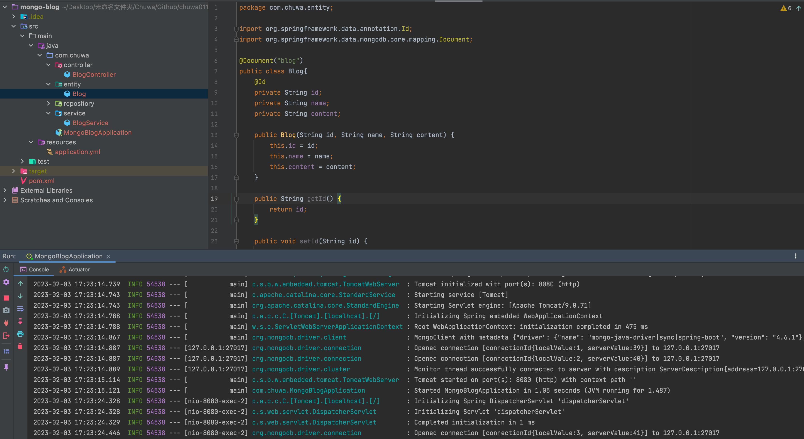
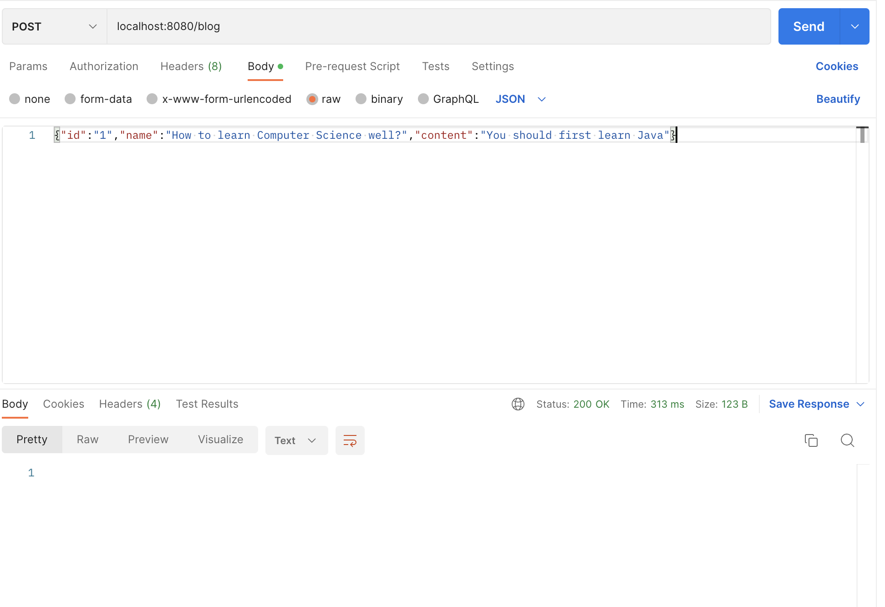
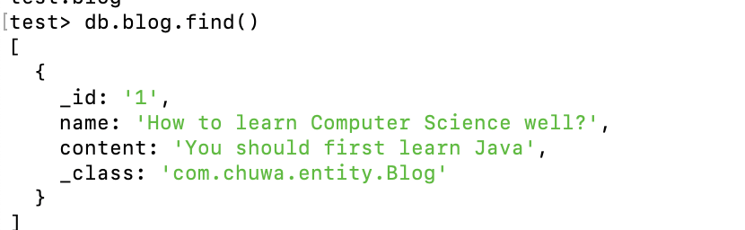

## Homework 8

Name: Zijun Zhou

##### 1.create a file to list all of the annotaitons you learned and known, and explain the usage and how do you understand it. you need to update it when you learn a new annotation. Please organize those annotations well, like annotations used by entity, annotations used by controller.
All the annotation examples have been listed on the annotations.md

##### 2. explain how the below annotaitons specify the table in database?
```
@Column(columnDefinition = "varchar(255) default 'John Snow'")
private String name;
```
This means that the field name corresponds to a field in our mysql table, and the type of that field is varchar(255) that is the string whose length is maximum 255. By default, if we don't specify the field in this POJO, the spring would help us insert the field's value as John Snow.

```
@Column(name="STUDENT_NAME", length=50, nullable=false, unique=false)
private String studentName;
```
This means that the corresponding field of studentName in our database table is named STUDENT_NAME, and its length is 50, and it could not be null, which means that if we insert a POJO whose studentName field is null, an exception would be thrown. Also, we do not need to make the student name unique, because there always exits multiple students whose name are the same.

##### 3. What is the default column names of the table in database for  @Column ?
```
@Column
private String firstName;
```
```
@Column
private String operatingSystem;
```

##### 4.What are the layers in springboot application? what is the role of each layer?
- Presentation Layer: This is used to respond to different types of requests coming from the user, and then capsulate the POJO objects to become JSON strings to the front-end pages.

- Business Layer: This is mainly to invoke different functions of the repository layers so that it could achieve different functions, such as deposit money should add money to the user account, and then add money on the total bank account.

- Persistence Layer: This is used to manipulate different sql sentences to CRUD the records in the database.

- Database Layer: This is actual database, which is responsible for storing the records.

##### 5. Describe the flow in all of the layers if an API is called by Postman.
First, a specific type of request is created by postman, and then send to the url of our spring boot application.
Second, the spring boot application would dispatch the request to the correct handler in our controllers(Presentation Layer)
Third, in the presentation layer, we extract the variables from the request body or path variable, and then invoke the methods in the business layer.
Fourth, in the business layer, we perform several operations by invoking the methods coming from the persistence layer
In the end, the persistence layer would perform the modification or fetching of data in the database
In all of these processes, if any exception is thrown, the presentation layer would send an error response body to the postman. If everything goes well, a successful status code would be used to respond to postman requests.

##### 6.What is the application.properties? do you know application.yml?
Below is an example of application.properties, we could see that each line belongs to one configuration. In addition, for the same spring.datasource configuration, we need to specify spring.datasource over and over again. And we could not see the hierarchy clearly.
```
spring.datasource.url=jdbc:h2:dev
spring.datasource.username=SA
spring.datasource.password=password
Copy
```
However, application.yml could represent the hierarchy:
```
spring:
    datasource:
        password: password
        url: jdbc:h2:dev
        username: SA
```
it's much more readable than using appplication.properties.


##### 7.Create a Project, name it with mongo-blog, write a POST API for mongo-blog, change database to MongoDB

After invoking postman to send post requests:

We could see that a new record is added to the MongoDB

All the code is included in MavenProject directory.

##### 8. In your redbook application, write the code for RUD APIs
The code is included in MavenProject directory.